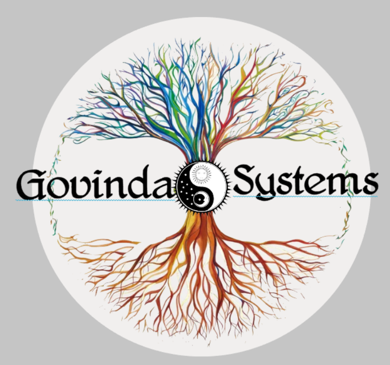
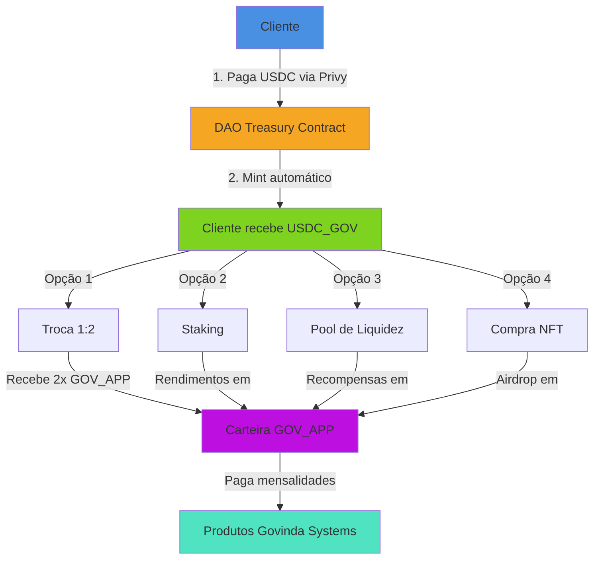
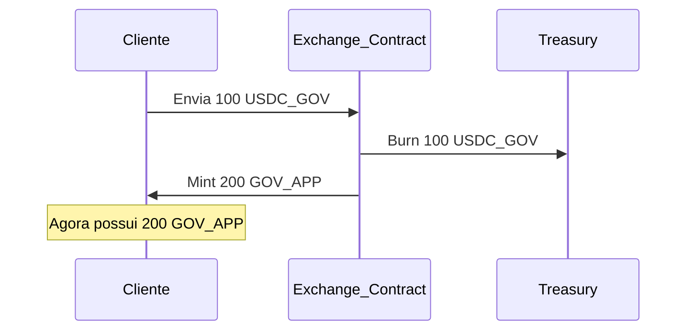
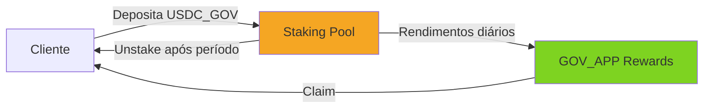
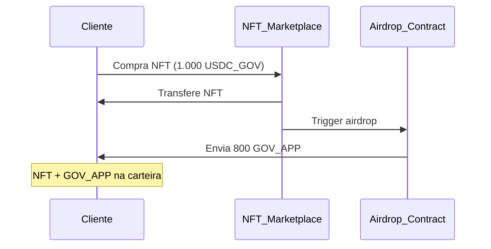
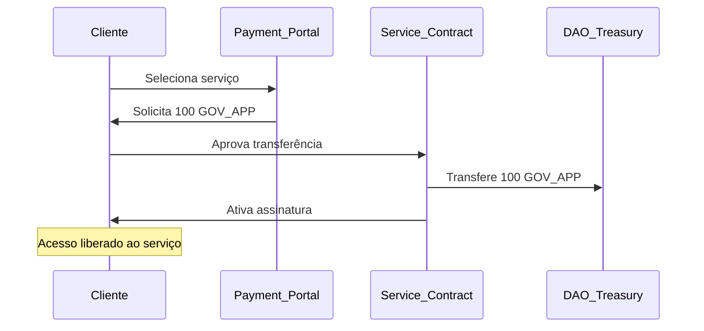
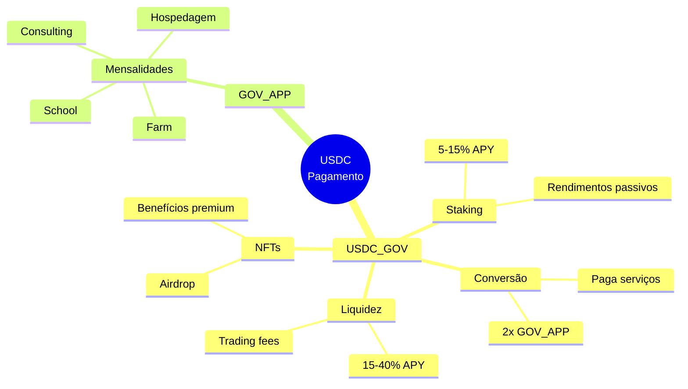

<p align="center">

</p>
<h1 align="center">
Fluxo de Pagamento - Govinda Systems DAO
</h1>
<p align="center">
Sistema de pagamento descentralizado com duplo token e múltiplas utilidades
</p>

---

## 📋 Índice

- [Visão Geral](#-visão-geral)
- [Arquitetura de Tokens](#-arquitetura-de-tokens)
- [Fluxo Completo](#-fluxo-completo)
- [Etapa 1: Pagamento Inicial](#etapa-1-pagamento-inicial)
- [Etapa 2: Recebimento de USDC_GOV](#etapa-2-recebimento-de-usdc_gov)
- [Etapa 3: Utilidades do USDC_GOV](#etapa-3-utilidades-do-usdc_gov)
- [Etapa 4: Utilização do GOV_APP](#etapa-4-utilização-do-gov_app)
- [Benefícios do Sistema](#-benefícios-do-sistema)
- [Casos de Uso](#-casos-de-uso)

---

## 🎯 Visão Geral

O sistema de pagamento da Govinda Systems DAO utiliza uma arquitetura de **duplo token** projetada para:

- **Estabilidade**: Pagamentos em stablecoin (USDC) garantem previsibilidade
- **Liquidez**: Conversão entre tokens e pools de liquidez
- **Recompensas**: Sistema de staking e airdrops incentiva participação
- **Utilidade**: Tokens GOV_APP usados para pagamento de serviços

O fluxo transforma **valor monetário** em **participação no ecossistema**, criando um ciclo virtuoso onde clientes se tornam **sócios e investidores** ativos da DAO.

---

## 🪙 Arquitetura de Tokens

### USDC (USD Coin)
- **Tipo**: Stablecoin atrelada ao dólar (1 USDC = 1 USD)
- **Função**: Moeda de entrada no ecossistema
- **Blockchain**: Ethereum / Base / Polygon
- **Integração**: Via Privy Wallet

### USDC_GOV (Govinda Stablecoin)
- **Tipo**: Token de participação lastreado em USDC
- **Função**: Representa investimento e direitos no ecossistema
- **Ratio**: 1:1 com USDC depositado
- **Contrato**: DAO Treasury Contract
- **Benefícios**: 
  - Conversão em GOV_APP (taxa 1:2)
  - Staking com rendimentos
  - Pool de liquidez
  - Compra de NFTs com airdrop

### GOV_APP (Govinda Application Token)
- **Tipo**: Token utilitário
- **Função**: Pagamento de mensalidades e serviços
- **Conversão**: 1 USDC_GOV = 2 GOV_APP
- **Uso**: Produtos e serviços da Govinda Systems

---

## 🔄 Fluxo Completo



---

## Etapa 1: Pagamento Inicial

### 💳 Cliente → DAO

**Processo:**

1. Cliente acessa plataforma Govinda Systems
2. Seleciona produto/serviço ou valor de investimento
3. Conecta carteira via **Privy** (integração Web3)
4. Realiza pagamento em **USDC**
5. Transação é enviada para o **contrato da DAO**

**Tecnologias:**

```javascript
// Integração Privy
const { login, authenticated, user } = usePrivy();

// Smart Contract Call
const payment = await daoContract.deposit(amount, {
  token: USDC_ADDRESS,
  from: user.wallet.address
});
```

**Vantagens:**

✅ Pagamento instantâneo (blockchain)  
✅ Sem intermediários bancários  
✅ Taxas reduzidas  
✅ Transparência total (on-chain)  
✅ Integração simples com Privy  

---

## Etapa 2: Recebimento de USDC_GOV

### 🪙 DAO → Cliente

**Processo:**

1. Contrato da DAO recebe USDC
2. **Mint automático** de USDC_GOV na proporção 1:1
3. USDC_GOV é transferido para carteira do cliente
4. USDC fica depositado no Treasury da DAO

**Smart Contract Logic:**

```solidity
function deposit(uint256 amount) external {
    // Recebe USDC do cliente
    USDC.transferFrom(msg.sender, address(this), amount);
    
    // Mint USDC_GOV 1:1
    USDC_GOV.mint(msg.sender, amount);
    
    // Atualiza treasury
    treasuryBalance += amount;
    
    emit Deposit(msg.sender, amount);
}
```

**Benefícios:**

✅ Cliente mantém exposição ao valor (USDC_GOV ≈ USDC)  
✅ Liquidez garantida pelo treasury  
✅ Direitos de participação no ecossistema  
✅ Base para todas as outras utilidades  

---

## Etapa 3: Utilidades do USDC_GOV

Com **USDC_GOV** na carteira, o cliente/sócio/investidor possui **4 opções principais**:

### 🔄 Opção 1: Conversão para GOV_APP

**Descrição:**  
Troca de USDC_GOV por GOV_APP com **taxa de 2x**

**Mecânica:**
```
1 USDC_GOV = 2 GOV_APP
```

**Quando usar:**
- Precisa pagar mensalidades imediatas
- Quer utilizar serviços da plataforma
- Busca liquidez rápida para uso interno

**Processo:**



---

### 💰 Opção 2: Staking

**Descrição:**  
Deposita USDC_GOV em pool de staking para receber **rendimentos passivos em GOV_APP**

**Características:**
- **APY**: 5% - 15% (variável)
- **Lock Period**: Flexível (7, 30, 90, 180 dias)
- **Recompensas**: Pagas em GOV_APP
- **Resgate**: USDC_GOV original + recompensas acumuladas

**Mecânica:**



**Exemplo Prático:**

| Depósito | Período | APY | Recompensa Total |
|----------|---------|-----|------------------|
| 1.000 USDC_GOV | 30 dias | 8% | 6.67 GOV_APP |
| 1.000 USDC_GOV | 90 dias | 12% | 30 GOV_APP |
| 1.000 USDC_GOV | 180 dias | 15% | 75 GOV_APP |

**Quando usar:**
- Não precisa de liquidez imediata
- Quer rendimentos passivos
- Acredita no crescimento do ecossistema
- Estratégia de longo prazo

---

### 🌊 Opção 3: Pool de Liquidez

**Descrição:**  
Fornece liquidez para o par **USDC_GOV/GOV_APP** em DEX (Uniswap, SushiSwap)

**Mecânica:**
- Deposita USDC_GOV + GOV_APP em proporção (ex: 50/50)
- Recebe LP Tokens (Liquidity Provider Tokens)
- Ganha % de todas as taxas de swap
- Recompensas adicionais em GOV_APP

**Rendimentos:**

1. **Trading Fees**: 0.3% de cada troca no par
2. **Liquidity Mining**: Tokens GOV_APP como incentivo
3. **APY Total**: 15% - 40% (variável com volume)

**Riscos:**
- **Impermanent Loss**: Se GOV_APP valorizar muito vs USDC_GOV
- Mitigado por recompensas adicionais

**Quando usar:**
- Busca máxima rentabilidade
- Entende mecânica de LP
- Tem ambos os tokens
- Visão de longo prazo

---

### 🎨 Opção 4: Compra de NFT

**Descrição:**  
Usa USDC_GOV para comprar NFTs exclusivos da coleção Govinda Systems

**Benefícios:**
- **NFT de Participação**: Acesso a áreas premium
- **Airdrop Imediato**: Recebe GOV_APP no momento da compra
- **Utilidades**: Descontos, acesso antecipado, governança especial
- **Colecionável**: Pode revender no mercado secundário

**Tipos de NFTs:**

| NFT | Preço (USDC_GOV) | Airdrop (GOV_APP) | Benefícios |
|-----|------------------|-------------------|------------|
| Bronze | 100 | 50 | 5% desconto + Forum |
| Silver | 500 | 300 | 10% desconto + Eventos |
| Gold | 1.000 | 800 | 15% desconto + Mentoria |
| Platinum | 5.000 | 5.000 | 25% desconto + Co-working |

**Processo:**



**Quando usar:**
- Quer acesso premium à plataforma
- Busca benefícios exclusivos
- Vê valor colecionável
- Deseja airdrop imediato de GOV_APP

---

## Etapa 4: Utilização do GOV_APP

### 💳 Pagamento de Mensalidades

Com **GOV_APP** na carteira, o cliente pode pagar:

**Produtos e Serviços:**

| Produto | Preço Mensal (GOV_APP) | Equivalente USD |
|---------|------------------------|-----------------|
| School (Curso AI) | 100 GOV_APP | $50 |
| Consulting (1h) | 200 GOV_APP | $100 |
| Farm (Desenvolvimento) | 1.000 GOV_APP | $500 |
| Hospedagem Web3 | 50 GOV_APP | $25 |

**Vantagens:**
- ✅ Sem taxas de cartão de crédito
- ✅ Pagamento instantâneo
- ✅ Sem conversão de moeda
- ✅ Transparência blockchain

**Processo de Pagamento:**



---

## 🎁 Benefícios do Sistema

### Para o Cliente/Investidor

✅ **Dupla função**: Cliente e co-proprietário simultaneamente  
✅ **Flexibilidade**: 4 formas de utilizar USDC_GOV  
✅ **Rendimentos**: Staking e pools de liquidez  
✅ **Valorização**: GOV_APP pode apreciar com demanda  
✅ **Utilidade real**: Paga serviços com os tokens  
✅ **Airdrop**: NFTs geram tokens imediatos  
✅ **Governança**: Participação em decisões da DAO  

### Para a Govinda Systems DAO

✅ **Liquidez**: USDC no treasury garante estabilidade  
✅ **Engajamento**: Clientes tornam-se stakeholders  
✅ **Retenção**: Sistema de recompensas incentiva permanência  
✅ **Network Effect**: Quanto mais usuários, maior liquidez  
✅ **Transparência**: Todas transações on-chain  
✅ **Descentralização**: Reduz dependência de sistemas tradicionais  

---

## 💼 Casos de Uso

### Caso 1: Cliente que quer serviços imediatos

**Perfil:** Empresa que precisa de consultoria

**Fluxo:**
1. Paga 1.000 USDC → Recebe 1.000 USDC_GOV
2. Converte 500 USDC_GOV → Recebe 1.000 GOV_APP
3. Mantém 500 USDC_GOV em staking (renda passiva)
4. Usa GOV_APP para pagar 10 meses de consultoria

**Resultado:**  
- ✅ Serviço pago antecipadamente  
- ✅ Ainda tem investimento gerando rendimentos  

---

### Caso 2: Investidor de longo prazo

**Perfil:** Pessoa que acredita no projeto

**Fluxo:**
1. Paga 10.000 USDC → Recebe 10.000 USDC_GOV
2. Coloca 5.000 USDC_GOV em staking (180 dias, 15% APY)
3. Fornece liquidez com outros 5.000 USDC_GOV + GOV_APP
4. Recebe rendimentos passivos mensais

**Resultado:**  
- ✅ ~375 GOV_APP do staking (6 meses)  
- ✅ ~2.000 GOV_APP de LP rewards  
- ✅ Total: ~2.375 GOV_APP ($1.187 valor)  
- ✅ ROI: 11,87% em 6 meses  

---

### Caso 3: Colecionador de NFTs

**Perfil:** Entusiasta Web3

**Fluxo:**
1. Paga 5.000 USDC → Recebe 5.000 USDC_GOV
2. Compra NFT Platinum por 5.000 USDC_GOV
3. Recebe airdrop de 5.000 GOV_APP
4. Usa GOV_APP para pagar anos de serviços

**Resultado:**  
- ✅ NFT colecionável  
- ✅ 25% desconto perpétuo em serviços  
- ✅ 5.000 GOV_APP ($2.500 valor)  
- ✅ Acesso co-working e mentoria  

---

### Caso 4: Mix estratégico

**Perfil:** Sócio-investidor equilibrado

**Fluxo:**
1. Paga 10.000 USDC → Recebe 10.000 USDC_GOV
2. Distribui:
   - 2.000 USDC_GOV → Staking
   - 3.000 USDC_GOV → Pool de liquidez
   - 1.000 USDC_GOV → Compra NFT Gold
   - 4.000 USDC_GOV → Converte em 8.000 GOV_APP

**Resultado:**  
- ✅ Renda passiva (staking + LP)  
- ✅ NFT + benefícios + 800 GOV_APP airdrop  
- ✅ 8.800 GOV_APP para uso imediato  
- ✅ Portfólio diversificado  

---

## 📊 Resumo do Fluxo



---

## 🔐 Segurança e Transparência

### Smart Contracts Auditados
- ✅ Código open-source
- ✅ Auditoria de segurança
- ✅ Multi-sig wallet no treasury
- ✅ Time-locks em alterações críticas

### Transparência On-Chain
- 🔍 Todos pagamentos rastreáveis
- 🔍 Treasury balance público
- 🔍 Distribuição de tokens visível
- 🔍 Governança descentralizada

### Garantias
- 💰 USDC no treasury = USDC_GOV circulante (1:1)
- 💰 Liquidez sempre garantida
- 💰 Sem risco de inflação descontrolada
- 💰 Burn de tokens cria deflação

---

## 🚀 Próximos Passos

1. **Conecte sua carteira** com Privy
2. **Escolha seu valor** de investimento
3. **Receba USDC_GOV** instantaneamente
4. **Explore as 4 opções** de utilização
5. **Participe do ecossistema** como sócio-investidor

---

## 📞 Suporte

- **Email**: contato@govindasystems.com
- **Discord**: [Comunidade Govinda Systems]
- **Docs**: https://docs.govindasystems.com
- **Tutorial**: https://govindasystems.com/tutorial-pagamento

---

## 📚 Documentação Relacionada

- [Token Ecosystem](token.md)
- [DAO Governance](dao.md)
- [Configuração Privy](CONFIGURACAO_PRIVY.md)
- [Smart Contracts](src/blockchain/README.md)

---

<p align="center">
<strong>Govinda Systems DAO</strong><br>
Simplificando a Tecnologia para Todos
</p>

