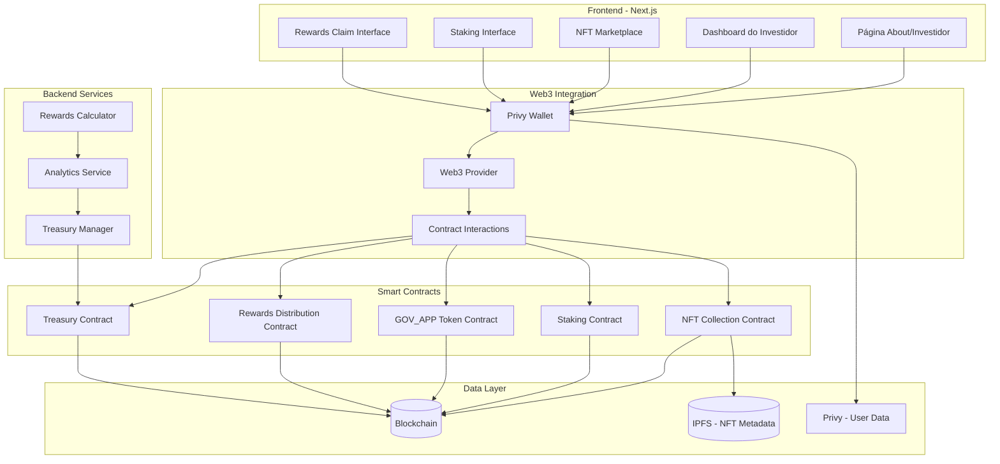
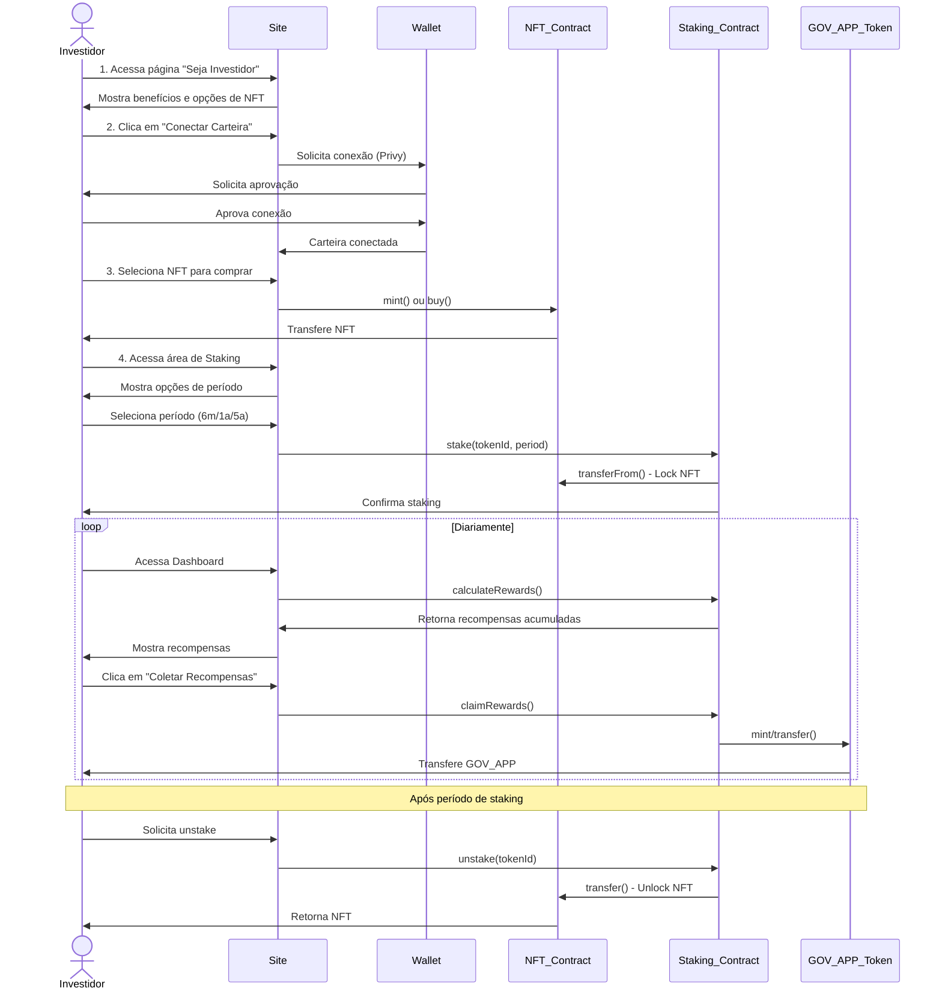
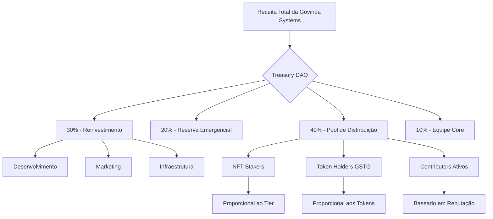

# Plano de Implementação - Área do Investidor com NFT Staking

## 📋 Índice

1. [Visão Geral](#visão-geral)
2. [Objetivos](#objetivos)
3. [Arquitetura da Solução](#arquitetura-da-solução)
4. [Fluxo de Investimento](#fluxo-de-investimento)
5. [Sistema de Staking](#sistema-de-staking)
6. [Distribuição de Lucros](#distribuição-de-lucros)
7. [Componentes do Site](#componentes-do-site)
8. [Smart Contracts Necessários](#smart-contracts-necessários)
9. [Estrutura de Dados](#estrutura-de-dados)
10. [Roadmap de Implementação](#roadmap-de-implementação)

---

## 🎯 Visão Geral

Esta seção do site tem como objetivo transformar a experiência do investidor na Govinda Systems DAO, permitindo que qualquer pessoa se torne sócio/investidor através da compra e staking de NFTs da coleção Govinda Systems, recebendo recompensas diárias em GOV_APP tokens que podem ser usados para pagar assinaturas dos produtos da empresa.

### Proposta de Valor

- **Para Investidores**: Retorno passivo através de recompensas diárias + participação nos lucros
- **Para a Govinda Systems**: Capital inicial + investidores engajados por longo prazo
- **Para o Ecossistema**: Utility real para NFTs + economia circular com GOV_APP

---

## 🎯 Objetivos

### Objetivos Primários

1. **Transparência Total**: Mostrar como a empresa funciona por dentro
2. **Fluxo de Caixa Visível**: Demonstrar o fluxo de pagamentos e receitas
3. **Distribuição de Lucros Clara**: Explicar como os lucros são divididos entre stakeholders
4. **Processo de Investimento Simples**: Tornar fácil e intuitivo se tornar investidor

### Objetivos Secundários

1. Criar utility para NFTs da Govinda Systems
2. Estabelecer economia circular com token GOV_APP
3. Aumentar engajamento de longo prazo dos investidores
4. Construir comunidade de holders comprometidos

---

## 🏗️ Arquitetura da Solução

### Diagrama de Arquitetura Geral



### Stack Tecnológico

#### Frontend
- **Framework**: Next.js 13+ (App Router)
- **UI Library**: React Bootstrap + Custom Components
- **Web3 Integration**: 
  - Privy (autenticação e carteira)
  - ethers.js ou viem (interação com blockchain)
- **State Management**: React Context API / Zustand
- **Charts**: Recharts / Chart.js

#### Blockchain
- **Network**: Ethereum / Polygon / Base (a definir)
- **Smart Contracts**: Solidity 0.8.x
- **Development**: Hardhat
- **Storage**: IPFS (metadados NFT)

#### Backend
- **API Routes**: Next.js API Routes
- **User Data**: Privy (autenticação e perfil)
- **Blockchain Data**: The Graph (indexação de eventos)
- **Cache**: Redis (opcional para dados da blockchain)

---

## 🔄 Fluxo de Investimento

### Jornada do Investidor



---

## 🔒 Sistema de Staking

### Tiers de Staking

| Tier | Período | APY GOV_APP | Bônus Lucro | Peso Governança |
|------|---------|-------------|-------------|-----------------|
| Bronze | 6 meses | 5% | 0.5% | 1x |
| Silver | 1 ano | 12% | 1.5% | 2x |
| Gold | 5 anos | 30% | 5% | 5x |

### Cálculo de Recompensas

```solidity
// Pseudo-código do cálculo de recompensas

function calculateDailyReward(uint256 tokenId) public view returns (uint256) {
    StakeInfo memory stake = stakes[tokenId];
    
    // Base reward baseado no valor da NFT
    uint256 nftValue = getNFTValue(tokenId);
    
    // APY baseado no período de staking
    uint256 apy = getAPYByPeriod(stake.period);
    
    // Recompensa diária = (valor_nft * apy) / 365
    uint256 dailyReward = (nftValue * apy) / (365 * 100);
    
    // Bônus por tempo de staking
    uint256 bonus = calculateLoyaltyBonus(stake.startTime);
    
    return dailyReward + bonus;
}
```

### Regras de Staking

1. **Lock Period**: NFT fica bloqueada no contrato durante período escolhido
2. **Early Withdrawal**: Permitido com penalidade de 30% das recompensas
3. **Auto-Renewal**: Opção de renovação automática ao fim do período
4. **Multiple Staking**: Permitido fazer stake de múltiplas NFTs
5. **Transferência**: NFT em staking não pode ser transferida

---

## 💰 Distribuição de Lucros

### Modelo de Revenue Sharing



### Fórmula de Distribuição para NFT Stakers

```javascript
// Cálculo de participação nos lucros trimestral

function calculateProfitShare(address investor) {
    // 1. Total de lucro líquido do trimestre
    let quarterProfit = getTreasuryProfitLastQuarter();
    
    // 2. Pool destinado aos stakers (40% do total)
    let stakersPool = quarterProfit * 0.40;
    
    // 3. Peso do investidor baseado em:
    let investorWeight = 0;
    
    // - Valor das NFTs em staking
    let nftValue = getStakedNFTValue(investor);
    
    // - Multiplicador do tier
    let tierMultiplier = getStakingTierMultiplier(investor);
    
    // - Tempo de staking
    let timeBonus = getStakingTimeBonus(investor);
    
    investorWeight = nftValue * tierMultiplier * timeBonus;
    
    // 4. Peso total de todos os stakers
    let totalWeight = getTotalStakersWeight();
    
    // 5. Participação do investidor
    let investorShare = (investorWeight / totalWeight) * stakersPool;
    
    return investorShare;
}
```

### Dashboard de Transparência

**Métricas a serem exibidas:**

1. **Receitas**
   - Receita total (mensal/trimestral/anual)
   - Receita por produto/serviço
   - Crescimento mês a mês

2. **Despesas**
   - Custo operacional
   - Investimentos em desenvolvimento
   - Marketing e aquisição
   - Infraestrutura

3. **Lucro**
   - Lucro líquido
   - Margem de lucro
   - Distribuição do lucro

4. **Treasury**
   - Saldo total
   - Assets em diferentes tokens
   - Histórico de distribuições

---

## 🎨 Componentes do Site

### Estrutura de Páginas

```
/
├── pages/
│   ├── about/
│   │   └── index.js (About expandido)
│   ├── investor/
│   │   ├── index.js (Hub do Investidor)
│   │   ├── how-it-works.js (Como funciona)
│   │   ├── dashboard.js (Dashboard pessoal)
│   │   └── transparency.js (Transparência financeira)
│   ├── nft/
│   │   ├── collection.js (Coleção NFTs)
│   │   └── marketplace.js (Compra/Venda)
│   └── staking/
│       ├── index.js (Interface de Staking)
│       └── rewards.js (Recompensas)
```

### 1. Componente: InvestorJourney

**Localização**: `src/web/components/investor/InvestorJourney.js`

```jsx
// Componente visual explicando os 3 passos

const InvestorJourney = () => {
  const steps = [
    {
      number: 1,
      title: "Compre uma NFT",
      description: "Adquira uma NFT da coleção Govinda Systems e torne-se parte da comunidade",
      icon: "🎨",
      action: "Ver Coleção"
    },
    {
      number: 2,
      title: "Faça Staking",
      description: "Escolha seu período de staking: 6 meses, 1 ano ou 5 anos",
      icon: "🔒",
      action: "Iniciar Staking"
    },
    {
      number: 3,
      title: "Colete Recompensas",
      description: "Receba diariamente GOV_APP tokens para pagar produtos e serviços",
      icon: "💎",
      action: "Ver Dashboard"
    }
  ];
  
  return (
    <section className="investor-journey">
      <h2>Como se Tornar Investidor</h2>
      <div className="steps-container">
        {steps.map(step => (
          <StepCard key={step.number} {...step} />
        ))}
      </div>
    </section>
  );
};
```

### 2. Componente: RevenueFlowDiagram

**Localização**: `src/web/components/investor/RevenueFlowDiagram.js`

```jsx
// Diagrama interativo do fluxo de receitas

const RevenueFlowDiagram = () => {
  return (
    <section className="revenue-flow">
      <h2>Como Funciona o Fluxo de Pagamentos</h2>
      
      {/* Diagrama visual com animações */}
      <div className="flow-diagram">
        <FlowNode 
          title="Clientes" 
          description="Pagam por produtos e serviços"
          amount="100%"
        />
        <FlowArrow />
        <FlowNode 
          title="Treasury DAO" 
          description="Armazenamento seguro na blockchain"
          amount="100%"
        />
        <FlowSplit>
          <FlowNode title="Reinvestimento" amount="30%" color="blue" />
          <FlowNode title="Reserva" amount="20%" color="green" />
          <FlowNode title="Distribuição" amount="40%" color="purple" />
          <FlowNode title="Equipe Core" amount="10%" color="orange" />
        </FlowSplit>
      </div>
      
      {/* Tabela de dados reais */}
      <RevenueTable />
    </section>
  );
};
```

### 3. Componente: StakingInterface

**Localização**: `src/web/components/staking/StakingInterface.js`

```jsx
const StakingInterface = () => {
  const [selectedNFT, setSelectedNFT] = useState(null);
  const [selectedPeriod, setSelectedPeriod] = useState('1year');
  const { userNFTs, stake } = useStaking();
  
  const periods = [
    { 
      id: '6months', 
      label: '6 Meses', 
      apy: 5, 
      profitShare: 0.5,
      minInvestment: '0.1 ETH' 
    },
    { 
      id: '1year', 
      label: '1 Ano', 
      apy: 12, 
      profitShare: 1.5,
      recommended: true,
      minInvestment: '0.1 ETH' 
    },
    { 
      id: '5years', 
      label: '5 Anos', 
      apy: 30, 
      profitShare: 5,
      minInvestment: '0.1 ETH' 
    }
  ];
  
  const handleStake = async () => {
    await stake(selectedNFT, selectedPeriod);
  };
  
  return (
    <div className="staking-interface">
      <h2>Faça Staking da sua NFT</h2>
      
      {/* Seleção de NFT */}
      <NFTSelector 
        nfts={userNFTs} 
        selected={selectedNFT}
        onSelect={setSelectedNFT}
      />
      
      {/* Seleção de período */}
      <PeriodSelector 
        periods={periods}
        selected={selectedPeriod}
        onSelect={setSelectedPeriod}
      />
      
      {/* Resumo e confirmação */}
      <StakingSummary 
        nft={selectedNFT}
        period={selectedPeriod}
        estimatedRewards={calculateEstimatedRewards()}
      />
      
      <button onClick={handleStake}>Confirmar Staking</button>
    </div>
  );
};
```

### 4. Componente: InvestorDashboard

**Localização**: `src/web/components/investor/InvestorDashboard.js`

```jsx
const InvestorDashboard = () => {
  const { 
    stakedNFTs, 
    totalRewards, 
    claimableRewards,
    profitShareHistory,
    portfolioValue 
  } = useInvestorData();
  
  return (
    <div className="investor-dashboard">
      <h1>Meu Dashboard de Investidor</h1>
      
      {/* Cards de resumo */}
      <div className="summary-cards">
        <SummaryCard 
          title="Valor do Portfolio"
          value={portfolioValue}
          change="+12.5%"
          icon="💼"
        />
        <SummaryCard 
          title="Recompensas Acumuladas"
          value={totalRewards}
          subtitle="GOV_APP Tokens"
          icon="💎"
        />
        <SummaryCard 
          title="Disponível para Coletar"
          value={claimableRewards}
          action="Coletar Agora"
          icon="🎁"
        />
        <SummaryCard 
          title="Lucro Distribuído (Total)"
          value={profitShareHistory.total}
          subtitle="Últimos 12 meses"
          icon="💰"
        />
      </div>
      
      {/* NFTs em Staking */}
      <section className="staked-nfts">
        <h2>Minhas NFTs em Staking</h2>
        <div className="nfts-grid">
          {stakedNFTs.map(nft => (
            <StakedNFTCard key={nft.id} nft={nft} />
          ))}
        </div>
      </section>
      
      {/* Gráfico de recompensas */}
      <section className="rewards-chart">
        <h2>Histórico de Recompensas</h2>
        <RewardsChart data={totalRewards.history} />
      </section>
      
      {/* Histórico de distribuição de lucros */}
      <section className="profit-share-history">
        <h2>Distribuição de Lucros</h2>
        <ProfitShareTable data={profitShareHistory.entries} />
      </section>
    </div>
  );
};
```

### 5. Componente: TransparencyDashboard

**Localização**: `src/web/components/investor/TransparencyDashboard.js`

```jsx
const TransparencyDashboard = () => {
  const { financialData, treasuryData } = useTransparencyData();
  
  return (
    <div className="transparency-dashboard">
      <h1>Transparência Financeira</h1>
      <p>Todos os dados são públicos e verificáveis na blockchain</p>
      
      {/* Métricas principais */}
      <section className="key-metrics">
        <MetricCard 
          title="Receita Total (Trimestre)"
          value={financialData.revenue.current}
          previous={financialData.revenue.previous}
          trend="up"
        />
        <MetricCard 
          title="Lucro Líquido"
          value={financialData.profit.current}
          margin={financialData.profit.margin}
        />
        <MetricCard 
          title="Assets no Treasury"
          value={treasuryData.totalValue}
          assets={treasuryData.assets}
        />
      </section>
      
      {/* Gráfico de receitas */}
      <section className="revenue-breakdown">
        <h2>Receitas por Produto/Serviço</h2>
        <RevenueChart data={financialData.revenueByProduct} />
      </section>
      
      {/* Distribuição de gastos */}
      <section className="expenses-breakdown">
        <h2>Distribuição de Gastos</h2>
        <ExpensesChart data={financialData.expenses} />
      </section>
      
      {/* Histórico de distribuições */}
      <section className="distribution-history">
        <h2>Histórico de Distribuições</h2>
        <DistributionTable data={financialData.distributions} />
      </section>
      
      {/* Link para blockchain explorer */}
      <div className="blockchain-verification">
        <h3>Verificar na Blockchain</h3>
        <a href={treasuryData.contractAddress} target="_blank">
          Ver Treasury Contract no Etherscan
        </a>
      </div>
    </div>
  );
};
```

### 6. Componente: HowItWorks

**Localização**: `src/web/components/investor/HowItWorks.js`

```jsx
const HowItWorks = () => {
  return (
    <div className="how-it-works">
      <h1>Como Funciona a Govinda Systems por Dentro</h1>
      
      {/* Seção: Estrutura da DAO */}
      <section className="dao-structure">
        <h2>Estrutura Organizacional</h2>
        <p>A Govinda Systems é uma DAO (Organização Autônoma Descentralizada)...</p>
        <DAOStructureDiagram />
      </section>
      
      {/* Seção: Fluxo de Pagamentos */}
      <section className="payment-flow">
        <h2>Fluxo de Pagamentos</h2>
        <ol>
          <li>Cliente contrata serviço/produto</li>
          <li>Pagamento é recebido (PIX, Crypto, Cartão)</li>
          <li>Valor convertido para stablecoins (USDC/USDT)</li>
          <li>Depositado no Treasury Contract</li>
          <li>Distribuído conforme regras da DAO</li>
        </ol>
        <PaymentFlowDiagram />
      </section>
      
      {/* Seção: Distribuição de Lucros */}
      <section className="profit-distribution">
        <h2>Como os Lucros são Divididos</h2>
        <ProfitDistributionDiagram />
        <div className="distribution-breakdown">
          <DistributionItem 
            percentage={30}
            title="Reinvestimento"
            description="Desenvolvimento, marketing, infraestrutura"
          />
          <DistributionItem 
            percentage={20}
            title="Reserva de Emergência"
            description="Fundo de segurança para momentos difíceis"
          />
          <DistributionItem 
            percentage={40}
            title="Distribuição aos Investidores"
            description="NFT Stakers, Token Holders, Contributors"
          />
          <DistributionItem 
            percentage={10}
            title="Equipe Core"
            description="Fundadores e equipe principal"
          />
        </div>
      </section>
      
      {/* Seção: Governança */}
      <section className="governance">
        <h2>Participação na Governança</h2>
        <p>Como investidor, você tem direito a voto em decisões importantes:</p>
        <ul>
          <li>Alocação de recursos do treasury</li>
          <li>Novos produtos e serviços</li>
          <li>Parcerias estratégicas</li>
          <li>Mudanças na tokenomics</li>
          <li>Aprovação de propostas da comunidade</li>
        </ul>
      </section>
    </div>
  );
};
```

---

## 🔗 Smart Contracts Necessários

### 1. GovindasystemsNFT.sol

```solidity
// SPDX-License-Identifier: MIT
pragma solidity ^0.8.20;

import "@openzeppelin/contracts/token/ERC721/ERC721.sol";
import "@openzeppelin/contracts/token/ERC721/extensions/ERC721URIStorage.sol";
import "@openzeppelin/contracts/access/Ownable.sol";

contract GovindasystemsNFT is ERC721, ERC721URIStorage, Ownable {
    uint256 private _nextTokenId;
    uint256 public constant MAX_SUPPLY = 10000;
    uint256 public mintPrice = 0.1 ether;
    
    // Tier da NFT (afeta recompensas)
    enum NFTTier { Bronze, Silver, Gold, Platinum }
    mapping(uint256 => NFTTier) public nftTier;
    
    constructor() ERC721("Govinda Systems Investor", "GSI") Ownable(msg.sender) {}
    
    function mint(address to, string memory uri, NFTTier tier) public payable {
        require(_nextTokenId < MAX_SUPPLY, "Max supply reached");
        require(msg.value >= mintPrice, "Insufficient payment");
        
        uint256 tokenId = _nextTokenId++;
        _safeMint(to, tokenId);
        _setTokenURI(tokenId, uri);
        nftTier[tokenId] = tier;
    }
    
    function getNFTTier(uint256 tokenId) public view returns (NFTTier) {
        return nftTier[tokenId];
    }
    
    // ... demais funções
}
```

### 2. NFTStaking.sol

```solidity
// SPDX-License-Identifier: MIT
pragma solidity ^0.8.20;

import "@openzeppelin/contracts/token/ERC721/IERC721.sol";
import "@openzeppelin/contracts/security/ReentrancyGuard.sol";
import "@openzeppelin/contracts/access/Ownable.sol";

contract NFTStaking is ReentrancyGuard, Ownable {
    IERC721 public nftContract;
    IERC20 public govAppToken;
    
    enum StakingPeriod { SixMonths, OneYear, FiveYears }
    
    struct StakeInfo {
        address owner;
        uint256 tokenId;
        uint256 startTime;
        uint256 endTime;
        StakingPeriod period;
        uint256 lastClaimTime;
        bool active;
    }
    
    mapping(uint256 => StakeInfo) public stakes;
    mapping(address => uint256[]) public userStakes;
    
    // APY por período (base 100 = 1%)
    mapping(StakingPeriod => uint256) public apyByPeriod;
    
    event Staked(address indexed user, uint256 indexed tokenId, StakingPeriod period);
    event Unstaked(address indexed user, uint256 indexed tokenId);
    event RewardsClaimed(address indexed user, uint256 amount);
    
    constructor(address _nftContract, address _govAppToken) Ownable(msg.sender) {
        nftContract = IERC721(_nftContract);
        govAppToken = IERC20(_govAppToken);
        
        // Definir APYs
        apyByPeriod[StakingPeriod.SixMonths] = 500;   // 5%
        apyByPeriod[StakingPeriod.OneYear] = 1200;     // 12%
        apyByPeriod[StakingPeriod.FiveYears] = 3000;   // 30%
    }
    
    function stake(uint256 tokenId, StakingPeriod period) external nonReentrant {
        require(nftContract.ownerOf(tokenId) == msg.sender, "Not NFT owner");
        
        // Transfer NFT to contract
        nftContract.transferFrom(msg.sender, address(this), tokenId);
        
        // Calculate end time based on period
        uint256 duration;
        if (period == StakingPeriod.SixMonths) duration = 180 days;
        else if (period == StakingPeriod.OneYear) duration = 365 days;
        else duration = 1825 days; // 5 years
        
        // Create stake
        stakes[tokenId] = StakeInfo({
            owner: msg.sender,
            tokenId: tokenId,
            startTime: block.timestamp,
            endTime: block.timestamp + duration,
            period: period,
            lastClaimTime: block.timestamp,
            active: true
        });
        
        userStakes[msg.sender].push(tokenId);
        
        emit Staked(msg.sender, tokenId, period);
    }
    
    function calculateRewards(uint256 tokenId) public view returns (uint256) {
        StakeInfo memory stakeInfo = stakes[tokenId];
        require(stakeInfo.active, "Not staked");
        
        // Tempo desde último claim
        uint256 timeStaked = block.timestamp - stakeInfo.lastClaimTime;
        
        // Base reward (valor da NFT seria obtido de um oracle ou fixo)
        uint256 nftValue = 0.1 ether; // Exemplo
        
        // APY do período
        uint256 apy = apyByPeriod[stakeInfo.period];
        
        // Cálculo: (nftValue * apy * timeStaked) / (365 days * 10000)
        uint256 reward = (nftValue * apy * timeStaked) / (365 days * 10000);
        
        return reward;
    }
    
    function claimRewards(uint256 tokenId) external nonReentrant {
        StakeInfo storage stakeInfo = stakes[tokenId];
        require(stakeInfo.active, "Not staked");
        require(stakeInfo.owner == msg.sender, "Not stake owner");
        
        uint256 rewards = calculateRewards(tokenId);
        require(rewards > 0, "No rewards to claim");
        
        stakeInfo.lastClaimTime = block.timestamp;
        
        // Transfer GOV_APP tokens
        require(govAppToken.transfer(msg.sender, rewards), "Transfer failed");
        
        emit RewardsClaimed(msg.sender, rewards);
    }
    
    function unstake(uint256 tokenId) external nonReentrant {
        StakeInfo storage stakeInfo = stakes[tokenId];
        require(stakeInfo.active, "Not staked");
        require(stakeInfo.owner == msg.sender, "Not stake owner");
        
        // Check if staking period ended
        bool earlyWithdrawal = block.timestamp < stakeInfo.endTime;
        
        if (earlyWithdrawal) {
            // Apply penalty (claim only 70% of rewards)
            uint256 rewards = calculateRewards(tokenId);
            uint256 penalizedRewards = (rewards * 70) / 100;
            if (penalizedRewards > 0) {
                govAppToken.transfer(msg.sender, penalizedRewards);
            }
        } else {
            // Claim full rewards
            claimRewards(tokenId);
        }
        
        stakeInfo.active = false;
        
        // Return NFT
        nftContract.transferFrom(address(this), msg.sender, tokenId);
        
        emit Unstaked(msg.sender, tokenId);
    }
    
    function getUserStakes(address user) external view returns (uint256[] memory) {
        return userStakes[user];
    }
    
    // ... demais funções administrativas
}
```

### 3. GOVAPPToken.sol

```solidity
// SPDX-License-Identifier: MIT
pragma solidity ^0.8.20;

import "@openzeppelin/contracts/token/ERC20/ERC20.sol";
import "@openzeppelin/contracts/access/AccessControl.sol";

contract GOVAPPToken is ERC20, AccessControl {
    bytes32 public constant MINTER_ROLE = keccak256("MINTER_ROLE");
    bytes32 public constant BURNER_ROLE = keccak256("BURNER_ROLE");
    
    // Máximo de supply (10 bilhões)
    uint256 public constant MAX_SUPPLY = 10_000_000_000 * 10**18;
    
    constructor() ERC20("Govinda App Token", "GOV_APP") {
        _grantRole(DEFAULT_ADMIN_ROLE, msg.sender);
        _grantRole(MINTER_ROLE, msg.sender);
    }
    
    function mint(address to, uint256 amount) public onlyRole(MINTER_ROLE) {
        require(totalSupply() + amount <= MAX_SUPPLY, "Max supply exceeded");
        _mint(to, amount);
    }
    
    function burn(uint256 amount) public onlyRole(BURNER_ROLE) {
        _burn(msg.sender, amount);
    }
    
    // Função para usar GOV_APP para pagar assinaturas
    function paySubscription(address subscriber, uint256 amount) external {
        require(balanceOf(subscriber) >= amount, "Insufficient balance");
        _burn(subscriber, amount);
    }
}
```

### 4. TreasuryDAO.sol

```solidity
// SPDX-License-Identifier: MIT
pragma solidity ^0.8.20;

import "@openzeppelin/contracts/access/Ownable.sol";
import "@openzeppelin/contracts/security/ReentrancyGuard.sol";

contract TreasuryDAO is Ownable, ReentrancyGuard {
    // Distribuição percentual
    uint256 public constant REINVESTMENT_PCT = 30;
    uint256 public constant RESERVE_PCT = 20;
    uint256 public constant DISTRIBUTION_PCT = 40;
    uint256 public constant CORE_TEAM_PCT = 10;
    
    // Endereços para distribuição
    address public reinvestmentWallet;
    address public reserveWallet;
    address public distributionContract;
    address public coreTeamWallet;
    
    // Métricas financeiras
    uint256 public totalRevenue;
    uint256 public totalDistributed;
    
    event RevenueReceived(uint256 amount, uint256 timestamp);
    event RevenueDistributed(uint256 amount, uint256 timestamp);
    
    constructor(
        address _reinvestment,
        address _reserve,
        address _distribution,
        address _coreTeam
    ) Ownable(msg.sender) {
        reinvestmentWallet = _reinvestment;
        reserveWallet = _reserve;
        distributionContract = _distribution;
        coreTeamWallet = _coreTeam;
    }
    
    // Receber pagamentos
    receive() external payable {
        totalRevenue += msg.value;
        emit RevenueReceived(msg.value, block.timestamp);
    }
    
    // Distribuir receitas
    function distributeRevenue() external onlyOwner nonReentrant {
        uint256 balance = address(this).balance;
        require(balance > 0, "No balance to distribute");
        
        uint256 toReinvestment = (balance * REINVESTMENT_PCT) / 100;
        uint256 toReserve = (balance * RESERVE_PCT) / 100;
        uint256 toDistribution = (balance * DISTRIBUTION_PCT) / 100;
        uint256 toCoreTeam = (balance * CORE_TEAM_PCT) / 100;
        
        payable(reinvestmentWallet).transfer(toReinvestment);
        payable(reserveWallet).transfer(toReserve);
        payable(distributionContract).transfer(toDistribution);
        payable(coreTeamWallet).transfer(toCoreTeam);
        
        totalDistributed += balance;
        
        emit RevenueDistributed(balance, block.timestamp);
    }
    
    // Getters para transparência
    function getBalance() external view returns (uint256) {
        return address(this).balance;
    }
    
    function getFinancialMetrics() external view returns (
        uint256 revenue,
        uint256 distributed,
        uint256 currentBalance
    ) {
        return (totalRevenue, totalDistributed, address(this).balance);
    }
}
```

### 5. ProfitDistribution.sol

```solidity
// SPDX-License-Identifier: MIT
pragma solidity ^0.8.20;

import "@openzeppelin/contracts/security/ReentrancyGuard.sol";
import "@openzeppelin/contracts/access/Ownable.sol";

interface IStaking {
    function getUserStakes(address user) external view returns (uint256[] memory);
    function stakes(uint256 tokenId) external view returns (
        address owner,
        uint256 tokenId,
        uint256 startTime,
        uint256 endTime,
        uint8 period,
        uint256 lastClaimTime,
        bool active
    );
}

contract ProfitDistribution is ReentrancyGuard, Ownable {
    IStaking public stakingContract;
    
    struct Distribution {
        uint256 amount;
        uint256 timestamp;
        uint256 totalStakers;
        mapping(address => bool) claimed;
    }
    
    mapping(uint256 => Distribution) public distributions;
    uint256 public distributionCount;
    
    event DistributionCreated(uint256 indexed distributionId, uint256 amount);
    event ProfitClaimed(address indexed user, uint256 indexed distributionId, uint256 amount);
    
    constructor(address _stakingContract) Ownable(msg.sender) {
        stakingContract = IStaking(_stakingContract);
    }
    
    // Criar uma nova distribuição de lucros
    function createDistribution() external payable onlyOwner {
        require(msg.value > 0, "No funds to distribute");
        
        uint256 distributionId = distributionCount++;
        Distribution storage dist = distributions[distributionId];
        dist.amount = msg.value;
        dist.timestamp = block.timestamp;
        dist.totalStakers = getTotalActiveStakers();
        
        emit DistributionCreated(distributionId, msg.value);
    }
    
    // Calcular participação do investidor
    function calculateUserShare(address user, uint256 distributionId) 
        public 
        view 
        returns (uint256) 
    {
        Distribution storage dist = distributions[distributionId];
        require(dist.amount > 0, "Distribution does not exist");
        
        // Calcular peso do usuário
        uint256 userWeight = calculateUserWeight(user, dist.timestamp);
        uint256 totalWeight = calculateTotalWeight(dist.timestamp);
        
        if (totalWeight == 0) return 0;
        
        return (dist.amount * userWeight) / totalWeight;
    }
    
    // Reivindicar lucros
    function claimProfit(uint256 distributionId) external nonReentrant {
        Distribution storage dist = distributions[distributionId];
        require(dist.amount > 0, "Distribution does not exist");
        require(!dist.claimed[msg.sender], "Already claimed");
        
        uint256 userShare = calculateUserShare(msg.sender, distributionId);
        require(userShare > 0, "No share to claim");
        
        dist.claimed[msg.sender] = true;
        payable(msg.sender).transfer(userShare);
        
        emit ProfitClaimed(msg.sender, distributionId, userShare);
    }
    
    // Helpers
    function calculateUserWeight(address user, uint256 timestamp) 
        internal 
        view 
        returns (uint256) 
    {
        uint256[] memory userStakedTokens = stakingContract.getUserStakes(user);
        uint256 weight = 0;
        
        for (uint256 i = 0; i < userStakedTokens.length; i++) {
            (,,,, uint8 period,,bool active) = stakingContract.stakes(userStakedTokens[i]);
            
            if (active) {
                // Multiplicador baseado no período
                uint256 multiplier = 1;
                if (period == 0) multiplier = 1;      // 6 meses
                else if (period == 1) multiplier = 2; // 1 ano
                else multiplier = 5;                   // 5 anos
                
                weight += multiplier;
            }
        }
        
        return weight;
    }
    
    function calculateTotalWeight(uint256 timestamp) internal view returns (uint256) {
        // Implementar cálculo do peso total de todos os stakers
        // Pode ser otimizado com um snapshot off-chain
        return 1000; // Placeholder
    }
    
    function getTotalActiveStakers() internal view returns (uint256) {
        // Implementar contagem de stakers ativos
        return 100; // Placeholder
    }
}
```

---

## 📊 Estrutura de Dados

### Arquitetura Descentralizada (Sem Banco de Dados)

**Não utilizaremos banco de dados tradicional (PostgreSQL/MongoDB).** Todos os dados estarão distribuídos entre:

1. **Privy**: Dados de autenticação e perfil de usuário
2. **Blockchain**: Dados transacionais, NFTs, staking, rewards, treasury
3. **The Graph**: Indexação de eventos da blockchain para queries complexas
4. **IPFS**: Metadados das NFTs

### Vantagens desta Arquitetura:

✅ **Transparência Total**: Todos os dados on-chain são públicos e auditáveis  
✅ **Sem Single Point of Failure**: Dados distribuídos e descentralizados  
✅ **Imutabilidade**: Histórico completo e permanente  
✅ **Trustless**: Não dependemos de um servidor central  
✅ **Custos Reduzidos**: Sem necessidade de infraestrutura de banco de dados  

### Documentação Completa

Para detalhes completos sobre como os dados são armazenados e consultados, consulte:

👉 **[ESTRUTURA_DADOS_BLOCKCHAIN.md](./ESTRUTURA_DADOS_BLOCKCHAIN.md)**

Este documento contém:
- Schema de dados do Privy
- Estrutura de dados nos smart contracts
- Schema do The Graph para indexação
- Exemplos de código para consultar dados
- Estratégias de cache e performance

---

## 🗺️ Roadmap de Implementação

### Fase 1: Planejamento e Design (2 semanas)

**Semana 1-2:**
- [ ] Finalizar especificações técnicas
- [ ] Design UI/UX de todas as páginas
- [ ] Criar protótipos no Figma
- [ ] Definir tokenomics completa do GOV_APP
- [ ] Escolher blockchain (Ethereum mainnet, Polygon, Base, etc.)
- [ ] Planejar arquitetura de smart contracts

**Entregáveis:**
- Documento de especificação técnica completo
- Protótipos de alta fidelidade
- Whitepaper do sistema de staking
- Diagrama de arquitetura de smart contracts

---

### Fase 2: Desenvolvimento Smart Contracts (3 semanas)

**Semana 3-4:**
- [ ] Desenvolver GovindasystemsNFT.sol
- [ ] Desenvolver GOVAPPToken.sol
- [ ] Escrever testes unitários
- [ ] Auditoria interna de código

**Semana 5:**
- [ ] Desenvolver NFTStaking.sol
- [ ] Desenvolver TreasuryDAO.sol
- [ ] Desenvolver ProfitDistribution.sol
- [ ] Testes de integração

**Semana 6:**
- [ ] Testes end-to-end
- [ ] Simulações de cenários
- [ ] Ajustes e otimizações de gas
- [ ] Preparar para auditoria externa

**Entregáveis:**
- Smart contracts completos e testados
- Documentação técnica dos contratos
- Relatório de testes
- Scripts de deploy

---

### Fase 3: Desenvolvimento Frontend (4 semanas)

**Semana 7-8:**
- [ ] Estruturar páginas e rotas
- [ ] Implementar componentes base
- [ ] Integração com Privy
- [ ] Implementar InvestorJourney
- [ ] Implementar HowItWorks

**Semana 9:**
- [ ] Implementar StakingInterface
- [ ] Implementar InvestorDashboard
- [ ] Integração com smart contracts (read operations)
- [ ] Sistema de notificações

**Semana 10:**
- [ ] Implementar TransparencyDashboard
- [ ] Implementar RevenueFlowDiagram
- [ ] Integração completa com blockchain (write operations)
- [ ] Sistema de analytics

**Entregáveis:**
- Frontend funcional e responsivo
- Integração completa com Web3
- Dashboard interativo

---

### Fase 4: Backend e Integrações (2 semanas)

**Semana 11:**
- [ ] Setup The Graph (subgraph para indexação)
- [ ] Criar API Routes do Next.js
- [ ] Implementar serviço de cálculo de recompensas (leitura blockchain)
- [ ] Implementar serviço de analytics (The Graph queries)
- [ ] Integração com IPFS para metadados NFT
- [ ] Setup Privy para autenticação

**Semana 12:**
- [ ] Sistema de notificações (email/push via Privy)
- [ ] Cronjobs para atualização de cache
- [ ] Cache Redis (opcional) para dados da blockchain
- [ ] Implementar queries GraphQL para The Graph
- [ ] Testes de integração com blockchain

**Entregáveis:**
- Backend serverless funcional (Next.js API Routes)
- APIs documentadas
- The Graph subgraph deployado
- Serviços de indexação operacionais

---

### Fase 5: Testes e QA (2 semanas)

**Semana 13:**
- [ ] Testes funcionais completos
- [ ] Testes de usabilidade
- [ ] Testes de performance
- [ ] Testes de segurança
- [ ] Bug fixing

**Semana 14:**
- [ ] Testes em testnet (Goerli/Sepolia)
- [ ] Testes com usuários beta
- [ ] Ajustes finais
- [ ] Preparação para deploy

**Entregáveis:**
- Relatório de QA
- Documentação de bugs corrigidos
- Aprovação para produção

---

### Fase 6: Deploy e Lançamento (1 semana)

**Semana 15:**
- [ ] Auditoria externa de smart contracts (se necessário)
- [ ] Deploy de smart contracts na mainnet
- [ ] Deploy do frontend (Vercel)
- [ ] Setup de monitoramento e alertas
- [ ] Documentação de usuário
- [ ] Marketing e anúncio

**Entregáveis:**
- Sistema em produção
- Contratos verificados no Etherscan
- Documentação completa
- Material de marketing

---

### Fase 7: Pós-Lançamento (Contínuo)

**Mês 1-3:**
- [ ] Monitoramento contínuo
- [ ] Suporte aos primeiros investidores
- [ ] Coleta de feedback
- [ ] Ajustes e melhorias
- [ ] Primeira distribuição de lucros

**Mês 4-6:**
- [ ] Implementar melhorias baseadas em feedback
- [ ] Adicionar novas features
- [ ] Expansão de marketing
- [ ] Parcerias estratégicas

---

## 📈 Métricas de Sucesso

### KPIs Principais

1. **Adoção**
   - Número de NFTs vendidas
   - Número de NFTs em staking
   - Taxa de conversão (visitante → comprador)

2. **Engajamento**
   - Frequência de claims de recompensas
   - Tempo médio de staking
   - Taxa de renovação após período

3. **Financeiro**
   - Volume total em staking
   - Distribuição total de recompensas
   - Distribuição total de lucros

4. **Retenção**
   - Taxa de early withdrawal
   - Taxa de re-staking
   - NPS (Net Promoter Score)

---

## 🎨 Diretrizes de Design

### Paleta de Cores

```css
:root {
  /* Primárias */
  --primary-cyan: #2ECAD5;
  --primary-red: #FF6B6B;
  
  /* Backgrounds */
  --bg-dark: #111827;
  --bg-gradient-start: #111827;
  --bg-gradient-end: #15293E;
  
  /* Acentos */
  --accent-blue: #4A90E2;
  --accent-green: #50C878;
  --accent-yellow: #FFD700;
  
  /* Neutros */
  --text-primary: #FFFFFF;
  --text-secondary: #A0AEC0;
  --border-subtle: rgba(255, 255, 255, 0.1);
}
```

### Tipografia

```css
/* Headings */
h1 { font-size: 3rem; font-weight: 700; }
h2 { font-size: 2.25rem; font-weight: 600; }
h3 { font-size: 1.75rem; font-weight: 600; }

/* Body */
body { 
  font-family: 'Inter', -apple-system, sans-serif;
  font-size: 1rem;
  line-height: 1.6;
}
```

### Componentes Visuais

1. **Cards Glassmorphism**
   ```css
   .glass-card {
     backdrop-filter: blur(10px);
     background: rgba(255, 255, 255, 0.05);
     border: 1px solid rgba(255, 255, 255, 0.1);
     box-shadow: 0 20px 25px -5px rgba(0, 0, 0, 0.3);
     border-radius: 1rem;
   }
   ```

2. **Gradientes**
   ```css
   .gradient-text {
     background: linear-gradient(90deg, #2ECAD5, #FF6B6B);
     -webkit-background-clip: text;
     -webkit-text-fill-color: transparent;
   }
   ```

3. **Animações**
   - Hover effects suaves (transform: translateY(-5px))
   - Fade-ins para elementos importantes
   - Loading states claros e elegantes

---

## 🔐 Segurança

### Considerações de Segurança

1. **Smart Contracts**
   - Auditoria por empresa especializada (CertiK, OpenZeppelin)
   - Testes extensivos de edge cases
   - Uso de bibliotecas bem estabelecidas (OpenZeppelin)
   - Implementação de pausability para emergências

2. **Frontend**
   - Validação de inputs
   - Sanitização de dados
   - Proteção contra XSS
   - Rate limiting em transações

3. **Backend**
   - Autenticação robusta
   - Validação de assinaturas de wallet
   - Proteção de APIs
   - Logs de auditoria

4. **Operacional**
   - Uso de multi-sig para contratos críticos
   - Timelock para mudanças importantes
   - Monitoramento 24/7
   - Plano de resposta a incidentes

---

## 📚 Documentação Necessária

### Para Usuários

1. **Guia do Investidor**
   - Como comprar sua primeira NFT
   - Como fazer staking
   - Como coletar recompensas
   - FAQ

2. **Guia de Governança**
   - Como participar de votações
   - Como criar propostas
   - Entendendo seu poder de voto

3. **Tutoriais em Vídeo**
   - Walkthrough completo
   - Casos de uso
   - Melhores práticas

### Para Desenvolvedores

1. **Documentação Técnica**
   - Arquitetura do sistema
   - Documentação de APIs
   - Documentação de smart contracts

2. **Guias de Integração**
   - Como integrar com GOV_APP token
   - Como consultar dados de staking
   - Como verificar distribuições

---

## 💡 Ideias Futuras (V2)

1. **NFT Fracionada**: Permitir compra de frações de NFT
2. **Marketplace Secundário**: Permitir venda de NFTs em staking (com transferência do stake)
3. **Staking Líquido**: Criar token derivativo representando NFT em staking
4. **Boost System**: Multiplicadores temporários de recompensas
5. **Referral Program**: Recompensas por indicação de novos investidores
6. **Multi-Chain**: Expandir para outras blockchains
7. **Mobile App**: App nativo iOS/Android
8. **Gamification**: Sistema de achievements e rankings

---

## 📞 Próximos Passos

1. **Revisão deste Plano**
   - Feedback da equipe
   - Ajustes necessários
   - Aprovação final

2. **Alocação de Recursos**
   - Definir equipe
   - Estabelecer orçamento
   - Definir prazos definitivos

3. **Kickoff**
   - Reunião de alinhamento
   - Distribuição de tarefas
   - Setup de ferramentas e repositórios

---

## 📋 Checklist de Aprovação

Antes de iniciar a implementação, garantir que:

- [ ] Todos stakeholders revisaram e aprovaram o plano
- [ ] Orçamento está aprovado
- [ ] Equipe está alocada
- [ ] Blockchain escolhida e aprovada
- [ ] Tokenomics validada
- [ ] Design aprovado
- [ ] Requisitos legais verificados
- [ ] Estratégia de marketing definida
- [ ] KPIs acordados
- [ ] Plano de comunicação estabelecido

---

## 📝 Notas Finais

Este documento é um plano vivo e deve ser atualizado conforme o projeto evolui. Mudanças significativas devem ser documentadas e comunicadas a todos os stakeholders.

**Data de Criação**: Outubro 3, 2025  
**Versão**: 1.0  
**Próxima Revisão**: Após feedback inicial

---

**Contato para Dúvidas:**  
Email: dev@govindasystems.com  
Discord: [Link para servidor]  
Telegram: [Link para grupo]


