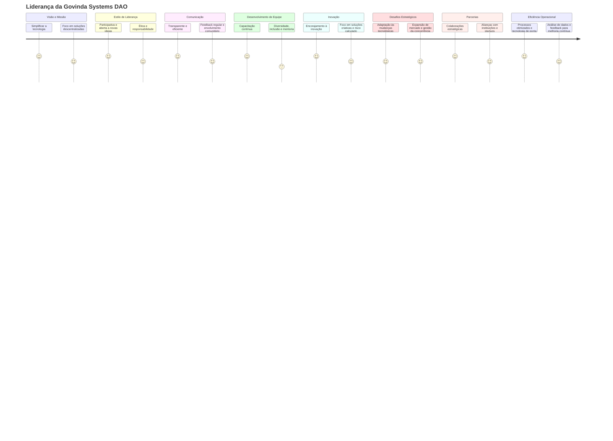

# Blue Ocean

## ESTRATÉGIA DO OCEANO VERMELHO VS ESTRATÉGIA DO OCEANO AZUL (RED OCEAN VS BLUE OCEAN STRATEGY)

Chan Kim e Renée Mauborgne cunharam os termos oceanos vermelhos e azuis para denotar o universo de mercado.

Oceanos vermelhos são todas as indústrias existentes hoje – o espaço de mercado conhecido, onde os limites da indústria são definidos e as empresas tentam superar seus rivais para capturar uma maior parcela do mercado existente. A competição acirrada torna o oceano vermelho de sangue. Daí o termo 'oceano vermelho'.

Oceanos azuis denotam todas as indústrias que não existem hoje – o espaço de mercado desconhecido, inexplorado e não contaminado pela competição. Como o 'oceano azul', é vasto, profundo e poderoso – em termos de oportunidade e crescimento lucrativo.

O gráfico abaixo resume as características distintas de competir em oceanos vermelhos (Estratégia do Oceano Vermelho) versus criar um oceano azul (Estratégia do Oceano Azul).

ESTRATÉGIA DO OCEANO VERMELHO
Competir no espaço de mercado existente
Superar a concorrência
Explorar a demanda existente
Fazer a troca entre valor e custo
Alinhar todo o sistema de atividades de uma empresa com sua escolha estratégica de diferenciação ou baixo custo

ESTRATÉGIA DO OCEANO AZUL
Criar espaço de mercado incontestável
Tornar a concorrência irrelevante
Criar e capturar nova demanda
Quebrar a troca entre valor e custo
Alinhar todo o sistema de atividades de uma empresa na busca de diferenciação e baixo custo
© Chan Kim & Renée Mauborgne. Todos os direitos reservados.

Diferenças fundamentais entre estratégia do oceano vermelho e estratégia do oceano azul

Para se sustentarem no mercado, os estrategistas do oceano vermelho focam em construir vantagens sobre a concorrência, geralmente avaliando o que os concorrentes fazem e se esforçando para fazer melhor. Aqui, capturar uma maior parcela de um mercado finito é visto como um jogo de soma zero, no qual o ganho de uma empresa é alcançado à custa da perda de outra. Eles focam em dividir o oceano vermelho, onde o crescimento é cada vez mais limitado. Esse pensamento estratégico leva as empresas a dividir as indústrias em atraentes e não atraentes e a decidir de acordo se entram ou não.

Os estrategistas do oceano azul reconhecem que os limites de mercado existem apenas na mente dos gestores, e não permitem que as estruturas de mercado existentes limitem seu pensamento. Para eles, existe demanda extra, em grande parte não aproveitada. O cerne do problema é como criá-la. Isso, por sua vez, requer uma mudança de atenção da oferta para a demanda, de um foco em competir para um foco em criar valor inovador para desbloquear nova demanda. Isso é alcançado através da busca simultânea de diferenciação e baixo custo.

Sob a estratégia do oceano azul, dificilmente existe uma indústria atraente ou não atraente per se, porque o nível de atratividade da indústria pode ser alterado através dos esforços conscientes das empresas. À medida que a estrutura de mercado é alterada ao quebrar a troca entre valor e custo, também são as regras do jogo. A competição no jogo antigo é, portanto, tornada irrelevante. Ao expandir o lado da demanda da economia, nova riqueza é criada. Tal estratégia permite, portanto, que as empresas joguem em grande parte um jogo de não soma zero, com possibilidades de alto retorno.

## VALUE INNOVATION

Value Innovation is the simultaneous pursuit of differentiation and low cost, creating a leap in value for both buyers and the company.

The concept of value innovation is developed by Chan Kim and Renée Mauborgne and is the cornerstone of market-creating strategy. Because value to buyers comes from the offering’s utility minus its price, and because value to the company is generated from the offering’s price minus its cost, value innovation is achieved only when the whole system of utility, price, and cost is aligned.

Cost savings are made by eliminating and reducing the factors an industry competes on.
Buyer value is lifted by raising and creating elements the industry has never offered.
© Chan Kim & Renée Mauborgne. All rights reserved.

Value innovation places equal emphasis on value and innovation. Value without innovation tends to focus on value creation on an incremental scale, something that improves value but is not sufficient to make you stand out in the marketplace. 

Innovation without value tends to be technology-driven, market-pioneering, or futuristic, often shooting beyond what buyers are ready to accept and pay for.Value innovation defies one of the most commonly accepted dogmas of competition-based strategy: the value-cost trade-off. It is conventionally believed that companies can create greater value to customers at a higher cost or create reasonable value at a lower cost.

Here strategy is seen as making a choice between differentiation and low cost. In contrast, those that seek to create blue oceans pursue differentiation and low cost simultaneously.

Break the value-cost trade-off by answering the following questions:

Which of the factors that the industry takes for granted should be eliminated?
Which factors should be reduced well below the industry’s standard?
What factors should be raised well above the industry’s standard?
What factors should be created that the industry has never offered?
The Rising Importance of Value Innovation for Creating New Growth
With limited resources at hand, companies need to stay smart and efficient when it comes to investing in innovation
Why Technology Innovation Only Counts When Linked to Buyer Value
Technology innovation can make a splash but you need to figure in value innovation
Why Lowering Costs and Increasing Value Doesn’t Need to be a Trade-Off
Break the value-cost trade-off with blue ocean strategy
Invention vs Innovation: The Important Difference for Your Organization’s Future Growth
And why you need to focus on value innovation instead
Why Companies Need to Take a Fresh Look at Innovation
Professor Chan Kim spoke at the Panasonic Cross-Value Innovation Forum 2018
Teaching Materials
Value innovation vs technology innovation

## STRATEGY CANVAS

Strategy Canvas is a central diagnostic tool and an action framework for building a compelling blue ocean strategy. It graphically captures, in one simple picture, the current strategic landscape and the future prospects for an organization. The strategy canvas is developed by Chan Kim and Renée Mauborgne.

The strategy canvas is a one-page visual analytic that depicts the way an organization configures its offering to buyers in relation to those of its competitors.

It crisply communicates the four key elements of strategy: the factors of competition, the offering level buyers receive across these factors, and your own and your competitors’ strategic profiles and cost structures.

And it tells a story: It allows you to see – and understand – where you and your competitors are currently investing; the product, service, and delivery factors the industry is competing on; and what customers receive from existing competitive offerings. 

blue ocean strategy canvas tool
© Chan Kim & Renee Mauborgne. All rights reserved.

The horizontal axis on the strategy canvas captures the range of factors that an industry competes on and invests in, while the vertical axis captures the offering level that buyers receive across all of these key competing factors.

A value curve or strategic profile is the graphic depiction of a company’s relative performance across its industry’s factors of competition.

The strategy canvas allows your organization to see in one simple picture all the factors an industry competes on and invests in, what buyers receive, and what the strategic profiles of the major players are. It exposes just how similar the players’ strategies look to buyers and reveals how they drive the industry toward the red ocean. Importantly, it creates a commonly owned baseline for change.

The strategy canvas serves two purposes:
It captures the current state of play in the known market space, which allows users to clearly see the factors that an industry competes on and invests in, what buyers receive, and what the strategic profiles of the major players are.
It propels users to action by reorienting their focus from competitors to alternatives and from customers to noncustomers of the industry and allows you to visualize how a blue ocean strategic move breaks away from the existing red ocean reality.
STRATEGY CANVAS EXAMPLES
See examples of strategy canvases in various industries and learn how organizations around the world created their blue ocean strategy. Learn from CitizenM, YellowTail, Apple, or Comic Relief, and more.

5 Strategy Canvas Examples
Visualize your strategy and stand out in a crowded market
DRAWING YOUR STRATEGY CANVAS
Learn how to draw a strategy canvas for your organization today. Get the strategy canvas template and a step-by-step tutorial on how to draw it.

Strategy Canvas Template
Stand out from the crowd and make your competition irrelevant

## BUYER UTILITY MAP

The Buyer Utility Map, developed by Chan Kim and Renée Mauborgne, helps to get managers thinking from a demand-side perspective. It outlines all the levers companies can pull to deliver exceptional utility to buyers as well as the various experiences buyers can have with a product or service. This mindset helps managers identify the full range of utility spaces that a product or service can potentially fill.

It has two dimensions: The Buyer Experience Cycle (BEC) and the Utility levers.

© Chan Kim & Renée Mauborgne. All rights reserved.

The Buyer Experience Cycle (BEC): A buyer’s experience can usually be broken into a cycle of six stages, running more or less sequentially from purchase to disposal.

Utility levers: Cutting across the stages of the buyer’s experience are what we call utility levers – the ways in which companies unlock utility for their customers.

By locating a new offering on one of the spaces of the buyer utility map, managers can clearly see how, and whether, the new idea creates a different utility proposition from existing offerings but also removes the biggest blocks to utility that stand in the way of converting noncustomers into customers. In our experience, managers all too often focus on delivering more of the same stage of the buyer’s experience. This approach may be reasonable in emerging industries, where there is plenty of room for improving a company’s utility proposition. But in many existing industries, this approach is unlikely to produce a market-shaping blue ocean strategy.

Buyer Utility Map examples
How to Think Outside the Box in Business
A blue ocean approach to out-of-the-box thinking
How to Turn Your Customers’ Pain Points into Opportunities
See how your industry is blocking utility for buyers with the Buyer utility Map

## THREE TIERS OF NONCUSTOMERS

The three tiers of noncustomers is an analytic framework developed by Chan Kim and Renée Mauborgne to help companies gain insight into the latent demand they can tap into to create blue oceans. Typically, to grow their share of a market, companies strive to retain and expand their existing customer base.

Although the universe of noncustomers typically offers blue ocean opportunities, few companies have keen insight into who noncustomers are and how to unlock them. To convert this huge latent demand into real demand in the form of new customers, companies need to deepen their understanding of the universe of noncustomers.

Customers of your industry
“Soon-to-be” noncustomers who are on the edge of your market waiting to jump ship
“Refusing” noncustomers who consciously choose against your market
“Unexplored” noncustomers who are in markets distant from yours
© Chan Kim & Renée Mauborgne. All rights reserved.

The first tier of noncustomers is closest to the current market, sitting just on the edge. They are buyers who minimally purchase an industry’s offering out of necessity but are mentally noncustomers of the industry.

The second tier of noncustomers is people who refuse to use an industry’s offering. These are buyers who have seen the current offering as an option to fulfill their needs but have decided against participating.

The third tier of noncustomers is farthest from the market. They are noncustomers who have never considered the market’s offering as an option.

By focusing on key commonalities across these noncustomers and existing customers, companies can understand how to pull them into their new market.

Three Tiers of Noncustomers Example
Customers First? How About Noncustomers First?
Why you need to identify the demand that exists beyond your industry
How to Create Your Blue Ocean Through Noncustomer Analysis
Discover how to reach beyond your existing industry's customers.

## SIX PATHS FRAMEWORK

The Six Paths Framework developed by Chan Kim and Renée Mauborgne allows managers to address the search risk many companies struggle with. It enables them to successfully identify out of the haystack of possibilities that exist, commercially compelling blue oceans by reconstructing market boundaries.

Industry
Head-to-Head Competition
Focuses on rivals within its industy
Blue Ocean Creation
Looks across alternative industries
Strategic Group
Focuses on competitive position within strategic group
Looks across strategic groups within industry
Buyer Group
Focuses on better serving the buyer group
Redefines the industry buyer group
Scope of Product or Service Offering
Focuses on maximizing the value of product and service offerings within the bounds of its industry
Looks across to complementary product and service offerings
Functional-emotional Orientation
Focuses on improving the price performance within the functional-emotional orientation of its industry
Rethinks the functional-emotional orientation of its industry
Time
Focuses on adapting to external trends as they occur
Participates in shaping external trends over time
© Chan Kim & Renée Mauborgne. All rights reserved.

The six paths framework provides six systematic ways to shift the lens you use in looking at the market universe and open up a new value-cost frontier. Path by path, the framework explains how to uncover plausible blue ocean opportunities by looking across an industry’s self-imposed boundaries, instead of remaining stuck within them.

This process enables you to break away from conventional competition-based thinking, shift your perspective and gain insights into how to reconstruct conventional boundaries to open new demand. Instead of looking within conventional boundaries, the six paths framework helps you to look across alternative industries, across strategic groups, across buyer groups, across complementary product and service offerings, across the functional-emotional orientation of an industry, and even across time.

© Chan Kim & Renée Mauborgne. All rights reserved.

Six paths framework examples
See how others have used the six paths framework.

How to Be Creative – 6 Proven Ways to Be More Creative Systematically
Why creativity is essential to strategic success

## FOUR ACTIONS FRAMEWORK

The Four Actions Framework developed by Chan Kim and Renée Mauborgne is used to reconstruct buyer value elements in crafting a new value curve or strategic profile. To break the trade-off between differentiation and low cost in creating a new value curve, the framework poses four key questions, shown in the diagram, to challenge an industry’s strategic logic.

Four Actions Framework Blue Ocean Strategy
© Chan Kim & Renee Mauborgne. All rights reserved.

 

The Four Actions Framework poses four key questions to translate insights into well-constructed strategies:

Which factors that the industry takes for granted should be eliminated?
Which factors should be reduced well below the industry’s standard?
Which factors should be raised well above the industry’s standard?
Which factors that the industry has never offered should be created?
These questions help you to challenge an industry’s strategic logic and business model to arrive at blue ocean moves that break the trade-off between differentiation and low cost.

Four Actions Framework Examples
Check out the Four Actions Framework examples and learn how to use the tool in action.
Learn how citizen and [yellow tail] reconstructed buyer value elements to offer buyers an entirely new experience, while simultaneously keeping their cost structure low.

Four Actions Framework Examples
Create a leap in value for buyers while keeping costs low

## ELIMINATE-REDUCE-RAISE-CREATE (ERRC) GRID

The Eliminate-Reduce-Raise-Create (ERRC) Grid is an essential tool of blue ocean strategy developed by Chan Kim and Renée Mauborgne. It is a simple matrix-like tool that drives companies to focus simultaneously on eliminating and reducing, as well as raising and creating while unlocking a new blue ocean.

ELIMINATE
Which factors that the industry has long competed on should be eliminated ?
RAISE
Which factors should be raised well above the industry’s standard?
REDUCE
Which factors should be reduced well below the industry’s standard?
CREATE
Which factors should be created that the industry has never offered?
© Chan Kim & Renée Mauborgne. All rights reserved.

This analytic tool complements the Four Actions Framework. It pushes companies not only to ask the questions posed in the Four Actions Framework but also to act on all four to create a new value curve (or strategic profile), which is essential to unlocking a new blue ocean. The grid gives companies four immediate benefits:

It pushes them to simultaneously pursue differentiation and low cost to break the value-cost trade-off.
It immediately flags companies that are focused only on raising and creating, thereby lifting the cost structure and often over-engineering products and services – a common plight for many companies.
It is easily understood by managers at any level, creating a high degree of engagement in its application.
Because completing the grid is a challenging task, it drives companies to thoroughly scrutinize every factor the industry competes on, helping them discover the range of implicit assumptions they unconsciously make in competing.
ERRC Grid Template and Examples
Learn how to use the ERRC Grid on the examples of CitizenM, [yellow tail], Apple’s iPhone, and Medellin’s Metrocable. Use the provided ERRC Grid template to develop concrete and actionable blue ocean strategic options that pursue both differentiation and low cost.

ERRC Grid Template and Examples
Create a leap in value for buyers while keeping costs low
A Blue Ocean Compass for Your Post-Covid Strategy
Four questions to help you rethink industry logic and existing practices to prepare for a powerful comeback
Think Different: Apple’s Blue Ocean Formula for Success
The strategic thinking behind the world’s most innovative company
How Shake Shack Flipped the Burger Restaurant
The gourmet fast food industry case study
Blue Ocean Strategy in the Hotel Industry
How citizenM created new market space in an overcrowded industry

## PIONEER MIGRATOR SETTLER MAP

A useful exercise for a corporate management team pursuing profitable growth is to plot the company’s current and planned portfolios on the Pioneer-Migrator-Settler Map created by Chan Kim and Renée Mauborgne.

Assessing your product/service offerings according to how much innovative value they offer buyers lets you see how strategically vulnerable or healthy your portfolio really is. The pioneer-migrator-setter map is divided into three segments: pioneers, migrators, and settlers.

© Chan Kim & Renée Mauborgne. All rights reserved.

Settlers are defined as me-too businesses, migrators are business offerings better than most in the marketplace, and a company’s pioneers are the businesses that offer unprecedented value. These are a company’s blue ocean strategic moves and are the most powerful sources of profitable growth. They are the only ones with a mass following of customers.

The pioneer-migrator-settler map tool guides you to target the area where you have the most to gain by the blue ocean journey and helps you select the right scope for your blue ocean initiative.

Pioneer Migrator Settler Map example:
Select the Right Strategic Initiatives to Plan Your Company’s Future Growth
How to manage your corporate portfolio

## PRICE CORRIDOR OF THE MASS

The Price Corridor of the Target Mass developed by Chan Kim and Renée Mauborgne is a tool managers can use to determine the right price to unlock the mass of target buyers. When setting a strategic price for a product or service, managers must evaluate the trade-offs that buyers consider when making their purchasing decision, as well as the level of legal and resource protection that will block other companies from imitating their offering.

Step one:

Identify the price corridor of the mass.

Step two:

Specify a price level within the price corridor.

Three alternative product service types:

Same Form
Different Form, Same Function
Different Form and Function, Same Objective

Size of circle is proportional to number
of buyers that product/service attracts

© Chan Kim & Renée Mauborgne. All rights reserved.

To set the strategic price, first identify the price corridor of the target mass, that is, the price range that attracts the mass of target buyers. Key to determining the strategic price is for managers to understand the price sensitivities of buyers who will be comparing the new offering with a host of very different-looking products and services offered outside the group of traditional competitors. For example, buyers can choose between several movie theatres, but they can also decide to go to restaurants and bars. Managers should consider two categories of products/services that are beyond an industry’s boundaries in identifying the price corridor of the mass: products and services that take different forms but perform the same function, and products and services that have different forms and functions but serve the same objective.

Next, determine how high or low the strategic price should be set within the corridor without inviting imitation from the competition.

A company must consider two sets of factors: the level of legal and resource protection the new offering has to block imitation, and secondly the degree to which the company owns some exclusive asset or core capability that can also block imitation.

The higher the level of protection against imitation, the higher the strategic price can be within the price range that still attracts the mass of target buyers. For example, if the product or service has strong patents and hard-to-imitate service capabilities one can use upper-boundary strategic pricing to attract the mass of buyers. On the other hand, if a manager is uncertain about their patent and asset protection they should consider pricing somewhere in the middle to lower end of the corridor.

## SEQUENCE OF CREATING A BLUE OCEAN

Companies need to build their blue ocean strategy in the sequence of buyer utility, price, cost, and adoption. This allows them to build a viable business model and ensure that a company profits from the blue ocean it is creating.

Chan Kim and Renée Mauborgne argue that with an understanding of the right strategic sequence and of how to assess blue ocean ideas against the key criteria in that sequence, companies can dramatically reduce business model risk and ensure that both the company and its customers win as it creates new business terrain.

© Chan Kim & Renée Mauborgne. All rights reserved.

Here Chan Kim and Renée Mauborgne articulate the strategic sequence of creating a commercially viable blue ocean idea.

The starting point is buyer utility. Does your offering unlock exceptional utility? Is there a compelling reason for the mass of people to buy it?

Second, is your offering priced to attract the mass of target buyers so that they have a compelling ability to pay for your offering? If it is not, they cannot buy it. Nor will the offering create irresistible market buzz.

The first two steps address the revenue side of a company’s business model. They ensure that you create a leap in net buyer value. To secure the profit side you need to assess the third element: cost. The cost side of a company’s business model ensures that it creates a leap in value for itself in the form of profit—that is, the price of the offering minus the cost of production. The key question here is: Can you produce your offering at the target cost and still earn a healthy profit margin? You should not let costs drive prices. Nor should you scale down utility because high costs block your ability to profit at the strategic price. When the target cost cannot be met, you must either forgo the idea because the blue ocean won’t be profitable, or you must innovate your business model to hit the target cost.

The last step in the sequence is to address adoption hurdles. What are the adoption hurdles in rolling out your idea? Have you addressed these up front? The formulation of blue ocean strategy is complete only when you can address adoption hurdles in the beginning to ensure the successful actualization of your idea.

## FIVE STEPS TO MAKING A BLUE OCEAN SHIFT

Whether you are a cash-strapped startup, nonprofit or a large, established company with bureaucratic obstacles, Blue Ocean Shift shows you how to build your people’s confidence and move from existing markets crowded with competition – or red oceans full of sharks – to blue oceans of new market space and explosive growth by applying a systematic five-step approach.

© Chan Kim & Renée Mauborgne. All rights reserved.

STEP 1: Get Started
Step 1 helps you to choose the right place to start your blue ocean initiative by guiding you towards focusing on areas that are most suitable, so that your zone of transformation is not too ambitious, in light of the organizational constraints you may face.

STEP 2: Understand Where You Are Now

Step 2 inspires a natural wake-up call in the team and the wider organization about the current state of play and creates real alignment and a collective will to make a shift by building a clear picture of the current competitive landscape.

STEP 3: Imagine Where You Could Be

Step 3 helps you to start to make the shift from what is to what could be by identifying specific pain points and unlocking unprecedented value for buyers. It helps you beak away from conceiving too narrowly of whom an industry’s customers are by exploring the total demand landscape outside the current industry’s understanding.

STEP 4: Find How You Get There

Step 4 shows you how to create commercially compelling new market space by redefining the playing field of strategy as well as how to formulate them into well-constructed strategies.

STEP 5: Make Your Move

Step 5 guides you towards deciding on which blue ocean move to pursue by enabling a fair process that consolidates people’s commitment to, and support for, the chosen move, culminating in alignment that allows top management to select the right option to move forward with.

## THREE KEY COMPONENTS OF A SUCCESSFUL BLUE OCEAN SHIFT

For a company to successfully shift from red to blue oceans, Chan Kim and Renée Mauborgne have identified three key components that are needed: adopting a blue ocean perspective; having tools and methodology for market creation; and having a humanistic process.

© Chan Kim & Renée Mauborgne. All rights reserved.

The first component, adopting a blue ocean perspective, opens your mind to what could be, instead of limiting it to what is. Organizations that shift from market competing to market creating ask fundamentally different sets of questions, which in turn enable them to perceive and appreciate the fallacies behind long-held industry assumptions and best practices.

The second component is having practical tools for market creation with proper guidance on how to apply them. If the right perspective is a matter of shifting one’s strategic thinking by asking different questions, market-creating tools and guidance enable you to ask the right questions at the right point in the process and to see the significance of the answers. Taken together, they build people’s creative competence. Step-by-step, they guide you through the central questions for making a blue ocean shift.

The third component is having humanness in the process, which builds peoples’ confidence to own and drive the blue ocean shift process for effective execution. Without the confidence to act, few venture down a new path, no matter how clear the roadmap. When creative competence and confidence to act are combined, real results are achievable.

Blue Ocean Shift shows you how to embrace and act on these three key components to successfully carve your path from market competing to market creating in a way that people own and drive the process.

 

Read the blog
The Three Key Components of a Successful Blue Ocean Shift
How the right perspective, practical tools and a humanistic process can help you shift to a blue ocean

## THREE COMPONENTS OF HUMANNESS

Humanness builds psychological understanding into the blue ocean shift process so that people are willing to engage fully at every step – even when they are hesitant, may not trust one another, or are skeptical of their ability to succeed on the transformation journey. The blue ocean shift process accomplishes this not by demanding that anyone change but by easing people’s fears and building their confidence step-by-step so they own and drive the process and are open to learn and free their imaginations from what is to imagine what could be.

To build humanness into the blue ocean shift process and help people develop the confidence to act, Chan Kim and Renée Mauborgne have identified three elements that address different aspects of our humanness: atomization, first-hand discovery, and the exercise of fair process.

© Chan Kim & Renée Mauborgne. All rights reserved.

Atomization involves deconstructing the challenge into small, concrete actions and focusing on completing them one at a time. This moves people forward in increments while inspiring and building their confidence step-by-step. Each step pushes the boundaries of their thinking, but no one step overwhelms them.

First-hand discovery enables people to discover for themselves, first-hand, the need for change, instead of being told. By not handing people predetermined conclusions and instead providing them tools to think in new ways and putting them face to face with the market, they discover for themselves the need-or the lack of need – to make a blue ocean shift. This moves them from the unsettling, highly vulnerable mindset of “I don’t know” to the quietly confident one of “I know,” not because they have been briefed by a report or told by a third-party focus group, but because they saw and experienced it for ourselves.

Fair process communicates through its action how much people are valued as individuals and recognized for their intellectual and emotional worth, thereby building trust and inspiring their voluntary cooperation in the process.

By weaving fair process together with atomization and first-hand discovery into the blue ocean shift process, humanness and, hence, confidence to act are instilled and reinforced. Execution is no longer an afterthought. Rather it is built into the process by creating people’s buy-in to the outcome of the process itself.

 

Read the blog:
Why You Need ‘Humanness’ to Make A Blue Ocean Shift
Humanness is having a humanistic process in your organization

## FOUR HURDLES TO STRATEGY EXECUTION

Once a company has developed a blue ocean strategy with a profitable business model, the next challenge is strategy execution. The challenge of execution exists, of course, for any strategy. Companies, like individuals, often have a tough time translating thought into action whether in red or blue oceans. But, compared with red ocean strategy, this can be especially difficult for blue ocean strategy as it represents a significant departure from the status quo.

To varying degrees, companies may face four types of hurdles to strategy execution. Knowing how to triumph over these organizational hurdles is key to successful strategy execution. Chan Kim and Renée Mauborgne identified four key hurdles to strategy execution:

© Chan Kim & Renée Mauborgne. All rights reserved.

The Cognitive Hurdle: Waking employees up to the need for a strategic shift. Red oceans may not be the paths to future profitable growth, but they may have served the organization well historically, so why rock the boat?

The Resource Hurdle: It is assumed that the greater the shift in strategy, the greater the resources it requires for execution.

The Motivational Hurdle: How do you motivate key players to move fast and tenaciously to carry out a break from the status quo? 

The Political Hurdle: As one manager put it, “In our organization, you get shot down before you stand up.”

Read the blog:
Four Hurdles to Strategy Execution in Your Organization
Overcome the cognitive, resource, motivational, and political challenges to make your strategy a reality.

## FAIR PROCESS

Fair process is a concept developed by Chan Kim and Renée Mauborgne that builds execution into strategy by creating people’s buy-in up front. When fair process is exercised in the strategy formulation phase, people trust that a level playing field exists, inspiring voluntary cooperation during the execution phase.

There are three mutually reinforcing elements that define fair process: engagement, explanation, and clarity of expectation. Whether people are senior executives or shop employees, they all look to these elements. Chan Kim and Renée Mauborgne call them the three Ε principles of fair process.

Engagement
Engagement means involving individuals in the strategic decisions that affect them by soliciting their input and allowing them to refute the merits of one another’s ideas and assumptions. Engagement communicates management’s respect for individuals and their point of view. The result is better strategic decisions by management and genuine commitment from everyone involved in execution.
Explanation
Explanation means that everyone involved and affected should understand why final strategic decisions are made. An explanation of rationale engenders confidence among employees that managers have considered their opinions and have made decisions impartially in the overall interest of the company, even if their own ideas have been rejected. It also serves as a powerful feedback loop to enhance learning.
Expectation Clarity
Expectation clarity requires that after a strategy is set, managers clearly state the new rules of the game. Although the expectations may be demanding, employees know up front the standards by which their work will be judged and the consequences of failure. When people clearly understand expectations, political jockeying and favoritism are minimized, and people can focus on executing the strategy rapidly.
© Chan Kim & Renée Mauborgne. All rights reserved.

It should be noted that any subset of the three is insufficient. The three criteria collectively lead to judgments of fair process.

Fair Process: Managing in the Knowledge Economy
How companies can tap into the voluntary cooperation of its people by building trust through fair processes

## TIPPING POINT LEADERSHIP

The conventional theory of organizational change rests on transforming the mass. So change efforts are focused on moving the mass, requiring steep resources and long time frames — luxuries few executives can afford. Tipping point leadership developed by Chan Kim and Renée Mauborgne, by contrast, takes a reverse course. To change the mass it focuses on transforming the extremes: the people, acts, and activities that exercise a disproportionate influence on performance. By transforming the extremes, tipping point leaders are able to change the core fast and at low cost to execute their new strategy.

Conventional Wisdom
The theory of organizational change rests on transforming the mass and these efforts require steep resources and long timeframes.

Tipping Point Leadership
To achieve a strategic shift at low cost, focus on the extremes – the people, acts, and activities that exert a disproportionate influence on performance.

© Chan Kim & Renée Mauborgne. All rights reserved.

Hence, contrary to conventional wisdom, mounting a massive challenge is not about putting forth an equally massive response where performance gains are achieved by proportional investments in time and resources. Rather, it is about conserving resources and cutting time by focusing on identifying and then leveraging the factors of disproportionate influence in an organization.

By single-mindedly focusing on points of disproportionate influence, tipping point leadership helps managers topple the four hurdles to strategy execution quickly and at a low cost by answering the following questions:

What factors or acts exercise a disproportionately positive influence on breaking the status quo?
On getting the maximum bang out of each buck of resources?
On motivating key players to aggressively move forward with change?
And on knocking down political roadblocks that often trip up even the best strategies?

## BLUE OCEAN LEADERSHIP VS CONVENTIONAL LEADERSHIP DEVELOPMENT APPROACHES

Most leadership development programs and leadership strategies are designed to hone the cognitive and behavioral skills of leaders with the implicit assumption that this would ultimately translate into high performance. Chan Kim and Renée Mauborgne’s Blue Ocean Leadership, in contrast, taps into the field of strategy by focusing on actions tied to market realities to rapidly bring about a step-change in leadership strength. It’s distinct from traditional leadership development approaches in several overarching ways as indicated in the table below:

Conventional Leadership Development Approaches
Focus on the values, qualities and behavioral styles that make for good leadership under the assumption that these ultimately translate into high performance.
Tend to be quite generic and are often detached from what organizations stand for in the eyes of their customers and the market results their people are expected to achieve.
Focus mostly on the executive and senior levels of organizations.
Invest extra time for leadership practices added on to people's regular work.
Blue Ocean Leadership
Focus on what acts and activities leaders need to undertake to boost their teams' motivation and business results, not on who leaders need to be.
Connect leaders' actions closely to market realities by having the people who face market realities define what leadership practices hold them back and what leadership actions would enable them to thrive and best serve customers and other key stakeholders.
Distribute leadership across all three management levels because outstanding organizational performance often comes down to the motivation and actions of middle and frontline leaders who are in closer contact with the market.
Pursue high-impact leadership acts and activities at low cost by focusing as much on what leaders need to eliminate and reduce in what they do as on what they need to raise and create.
© Chan Kim & Renée Mauborgne. All rights reserved.

Check out Chan Kim and Renée Mauborgne’s article in Harvard Business Review – Blue Ocean Leadership and unlock the ocean of unrealized talent and energy in the organization.

Learn more about Blue Ocean Leadership.

Read the blogs:

From Blue Ocean Strategy to Blue Ocean Leadership
The Four Pillars of Blue Ocean Leadership
How to See Your Current Leadership Reality
How to Develop and Select Your New Leadership Profiles
How to Institutionalize Your New Blue Ocean Leadership Practices
The Mind Map of Blue Ocean Leadership

## LEADERSHIP CANVAS

Chan Kim and Renée Mauborgne’s Leadership Canvas is a central, analytic tool of Blue Ocean Leadership. It gives managers a concrete, visual framework to draw a clear picture of the current leadership reality at various levels in an organization and to understand the way employees experience leadership and where leadership may be falling short. It allows them develop a new, effective blue ocean leadership profile that releases unrealized talent and energy of employees and lifts individual and organizational performance.

© Chan Kim & Renée Mauborgne. All rights reserved.

Start by listing key leadership acts and activities along the horizontal axis and plotting leaders’ investment of time and effort in each activity across the vertical axis. The big picture will give you keen insight into your current leadership reality and unlock your creativity to develop a new effective leadership profile for the future. To help leaders focus on what really matters, the tool requires 10 to 15 key leadership acts and activities to be listed across the horizontal axis. The cap of 10 to 15 prevents the canvas from becoming a statement of everything and nothing.

Check out Chan Kim and Renée Mauborgne’s article in Harvard Business Review – Blue Ocean Leadership and unlock the ocean of unrealized talent and energy in the organization.

Learn more about Blue Ocean Leadership.

Read the blogs:

From Blue Ocean Strategy to Blue Ocean Leadership
The Four Pillars of Blue Ocean Leadership
How to See Your Current Leadership Reality
How to Develop and Select Your New Leadership Profiles
How to Institutionalize Your New Blue Ocean Leadership Practices
The Mind Map of Blue Ocean Leadership
 

## BLUE OCEAN LEADERSHIP GRID

The Blue Ocean Leadership Grid developed by Chan Kim and Renee Mauborgne is an analytic tool that complements the Leadership Canvas and helps you formulate your blue ocean leadership profile that can unlock the ocean of unrealized talent and energy in your organization.

This is an action framework that drives you to find out what leadership activities should be eliminated, reduced, raised, and created to create a step-change in leadership strength and achieve high impact with a lower investment of time.

© Chan Kim & Renée Mauborgne. All rights reserved.

The tool drives you to ask four questions that challenge the current leadership reality:

Eliminate: Which acts and activities do leaders invest their time and intelligence in that should be eliminated?
Reduce: Which acts and activities do leaders invest their time and intelligence in that should be reduced well below their current level?
Raise: Which acts and activities do leaders invest their time and intelligence in that should be raised well above their current level?
Create: Which acts and activities should leaders invest their time and intelligence in that they currently don’t undertake?
Check out Chan Kim and Renée Mauborgne’s article in Harvard Business Review – Blue Ocean Leadership and unlock the ocean of unrealized talent and energy in the organization.

Learn more about Blue Ocean Leadership.

Read the blogs:

From Blue Ocean Strategy to Blue Ocean Leadership
The Four Pillars of Blue Ocean Leadership
How to See Your Current Leadership Reality
How to Develop and Select Your New Leadership Profiles
How to Institutionalize Your New Blue Ocean Leadership Practices
The Mind Map of Blue Ocean Leadership
 

## FOUR-STEP BLUE OCEAN LEADERSHIP PROCESS

Blue ocean leadership involves a four-step process developed by Chan Kim and Renée Mauborgne. It allows leaders to gain a clear understanding of just what changes it would take to bring out the best in their people while conserving their most precious resource: time.

© Chan Kim & Renée Mauborgne. All rights reserved.

Step 1: See your leadership reality

Step 2: Develop alternative Leadership Profiles

Step 3: Select to-be Leadership Profiles

Step 4: Institutionalize new leadership practices

Blue ocean leadership uses analytic tools like the Leadership Canvas and the Blue Ocean Leadership Grid to make this happen. These highly visual tools allow leaders and organizations to see, measure and track leadership changes in a real way which is much more practical and easier than trying to track changes in a leader’s values and behavioral traits.

Check out Chan Kim and Renée Mauborgne’s article in Harvard Business Review – Blue Ocean Leadership and unlock the ocean of unrealized talent and energy in the organization.

Learn more about Blue Ocean Leadership.

Read the blogs:

From Blue Ocean Strategy to Blue Ocean Leadership
The Four Pillars of Blue Ocean Leadership
How to See Your Current Leadership Reality
How to Develop and Select Your New Leadership Profiles
How to Institutionalize Your New Blue Ocean Leadership Practices
The Mind Map of Blue Ocean Leadership
 
## COST OF DISENGAGED EMPLOYEES

Employee engagement is a huge issue for companies big and small. Low engagement plagues many companies, dragging down productivity, hurting the bottom-line, and often making work environments themselves a drag. Engaged employees are far more productive than their disengaged counterparts.

In a study of 25,000 executives and employees, it was found that: A mere 30% of US employees are engaged, committed to doing a good job; 50% of employees merely put their time in; and 20% are counterproductive, negatively influencing coworkers, missing days at work and driving customers away through poor service. The 20% of counterproductive employees alone cost the USA economy about half a trillion a year.

Chan Kim and Renée Mauborgne have developed a tool to estimate the cost of disengaged employees in your organization. This provides you a rough estimate of the minimum annual benefit you can achieve in your leadership strength by applying blue ocean leadership in your organization.

A. Enter your number of employees
B. Multiply A by your estimate of the average annual salary of employees in your company. As a guide, for American companies, a reasonable estimate is $30,000 (1)
C. Multiply B by 20% (2)
______________Employees
______________ $/Annum
______________ $/Annum
(1) This provides a rough estimate of the minimum annual benefit you can achieve by creating a step-change in your leadership strength by applying blue ocean leadership in your organization.

(2) This is a reasonable approximate average salary plus benefits in the U.S. These numbers for most countries can be ascertained online if the actual average annual salary of your organization cannot be secured.

© Chan Kim & Renée Mauborgne. All rights reserved.

Check out Chan Kim and Renée Mauborgne’s article in Harvard Business Review – Blue Ocean Leadership and unlock the ocean of unrealized talent and energy in the organization.

Learn more about Blue Ocean Leadership.

Read the blogs:

From Blue Ocean Strategy to Blue Ocean Leadership
The Four Pillars of Blue Ocean Leadership
How to See Your Current Leadership Reality
How to Develop and Select Your New Leadership Profiles
How to Institutionalize Your New Blue Ocean Leadership Practices
The Mind Map of Blue Ocean Leadership
 