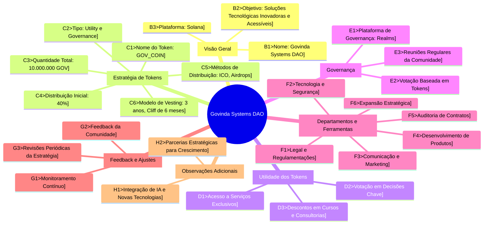

# 

**Formulário de Estratégia de Tokens para Govinda Systems DAO**

1. **Informações Gerais da DAO:**
   - Nome da DAO: Govinda Systems DAO
   - Objetivo principal da DAO: Oferecer soluções tecnológicas inovadoras e acessíveis, simplificando a tecnologia para todos.
   - Plataforma utilizada: Solana

2. **Detalhes do Token:**
   - Nome do Token: GOV_COIN
   - Símbolo do Token: GOV
   - Tipo de Token: Utility e Governance

3. **Estratégia de Distribuição:**
   - Método de Distribuição Inicial: ICO e airdrops para membros da comunidade
   - Quantidade Total de Tokens: 10 milhões de GOV
   - Percentual de Tokens para Distribuição Inicial: 40%
   - Descrição do Modelo de Vesting: Vesting de 3 anos com um cliff de 6 meses para os fundadores e equipe inicial

4. **Governança e Utilidade:**
   - Utilidade dos Tokens: Acesso a serviços exclusivos da DAO, descontos em cursos e consultorias, votação em decisões chave da DAO
   - Estrutura de Governança: Votação baseada em tokens para decisões importantes, reuniões regulares da comunidade para discussão e feedback

5. **Aspectos Legais e Regulamentações:**
   - Precauções legais consideradas: Conformidade com regulamentos de criptomoedas e leis fiscais internacionais

6. **Tecnologia e Segurança:**
   - Blockchain escolhida: Solana por sua eficiência e escalabilidade
   - Medidas de Segurança Implementadas: Auditorias regulares de contratos inteligentes, parcerias com firmas de segurança cibernética

7. **Comunicação e Marketing:**
   - Estratégias de Marketing: Parcerias com influenciadores no espaço tech e blockchain, campanhas em redes sociais, participação em conferências de tecnologia e blockchain
   - Canais de Comunicação com a Comunidade: Discord, Twitter, blog oficial

8. **Feedback e Ajustes:**
   - Processo para Monitoramento e Ajustes: Avaliações contínuas com base no feedback da comunidade, revisões periódicas de estratégias

9. **Outras Observações:**
   - Informações adicionais: Planos para expansão de serviços e produtos, integração de novas tecnologias e IA nas soluções oferecidas

---
