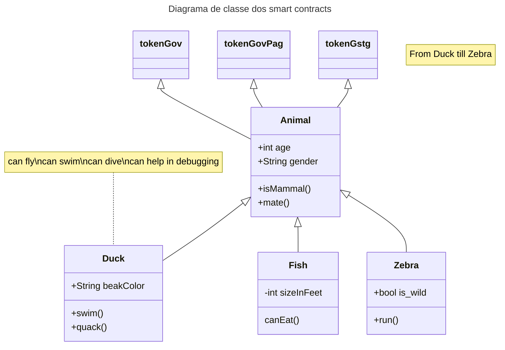

## 

```mermaid
classDiagram
    class GovindaSystemsDAO {
        -govCoins: uint
        +createProject(project: Project): bool
        +fundProject(project: Project, amount: uint): bool
        +getProjectDetails(project: Project): string
        +redeemGovCoinsForService(client: address, service: Service): bool
    }
    class Project {
        -title: string
        -description: string
        -budget: uint
        -status: ProjectStatus
        +updateStatus(status: ProjectStatus): void
    }
    class Service {
        -title: string
        -description: string
        -priceInGovCoins: uint
        +purchase(client: address, amount: uint): bool
    }
    enum ProjectStatus {
        PENDING
        APPROVED
        IN_PROGRESS
        COMPLETED
        CANCELED
    }
    GovindaSystemsDAO "1" -- "0..*" Project: manages
    GovindaSystemsDAO "1" -- "0..*" Service: offers
```