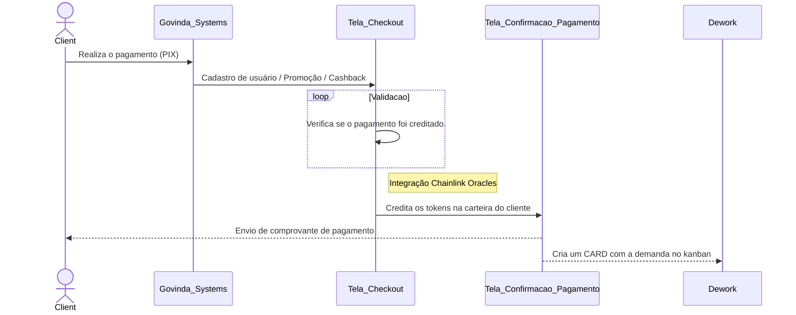
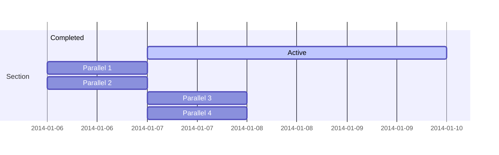
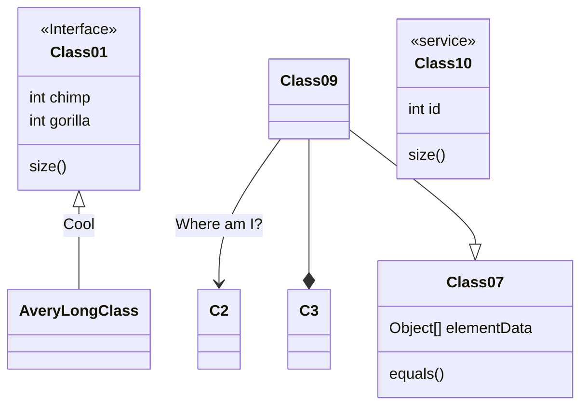
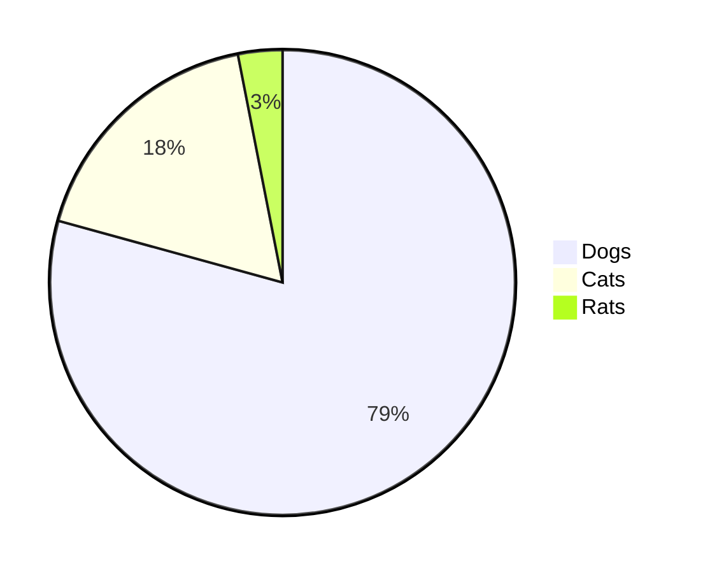
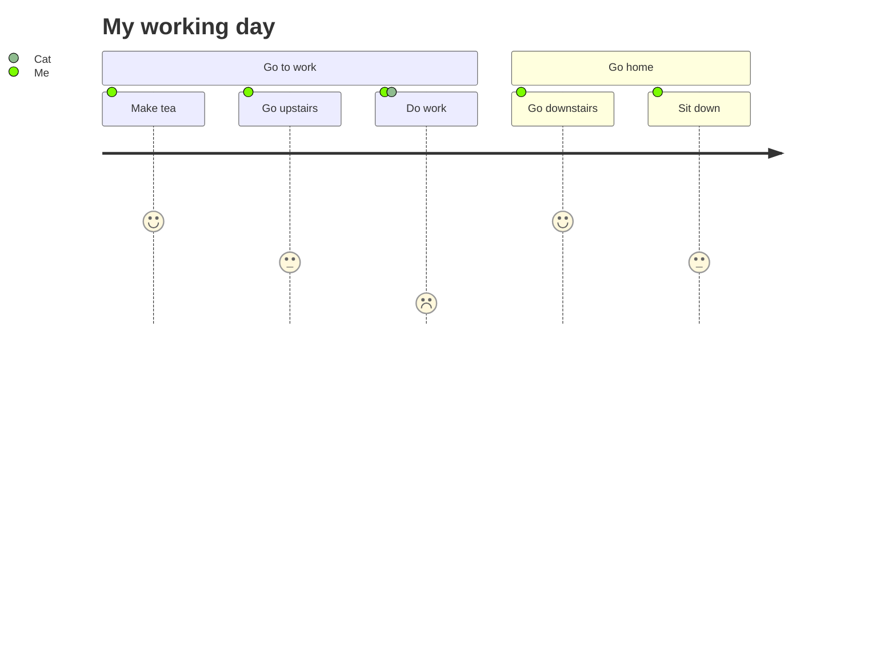
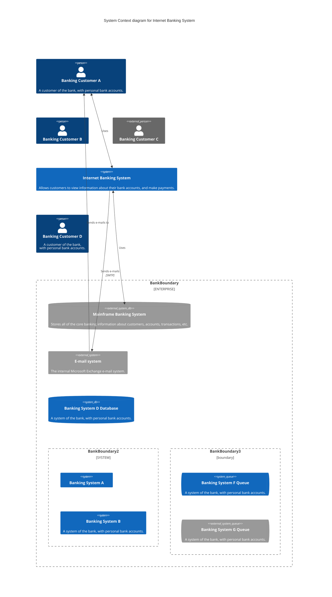

```mermaid
gantt
    title Git Issues - days since last update
    dateFormat  X
    axisFormat %s

    section Issue19062
    71   : 0, 71
    section Issue19401
    36   : 0, 36
    section Issue193
    34   : 0, 34
    section Issue7441
    9    : 0, 9
    section Issue1300
    5    : 0, 5
```

<p align="center">

</p>
<h1 align="center">
Tokens
</h1>
<p align="center">
Aprenda como nossos tokens funcionam.
<p>
<p align="center">
&
<p>
<p align="center">
Processo de cash back.
<p>

## GOV Coins

As **GOV Coins** podem ser utilizadas para a contratação de uma variedade de produtos e serviços oferecidos pela Govinda Systems DAO. Esses serviços incluem:

1. **Desenvolvimento de software personalizado**: A equipe da Govinda Systems pode criar soluções de software sob medida para atender às necessidades específicas dos clientes, seja para uma startup ou uma empresa estabelecida.

2. **Aplicações móveis e web**: A Govinda Systems tem experiência no desenvolvimento de aplicativos móveis e web eficientes e atraentes, que podem ajudar as empresas a expandir sua presença online e atrair novos clientes.

3. **Soluções em blockchain e criptomoedas (Dapp, Web3, Defi)**: A equipe da Govinda Systems possui conhecimentos avançados no desenvolvimento de soluções baseadas em blockchain, como aplicativos descentralizados (Dapps), projetos Web3 e finanças descentralizadas (DeFi).

4. **Consultoria e treinamento em tecnologia**: A Govinda Systems oferece serviços de consultoria e treinamento em várias áreas de tecnologia, ajudando as empresas a se manterem atualizadas com as tendências e práticas mais recentes do setor.

5. **Soluções e Consultoria em marketing digital**: A Govinda Systems também possui experiência em marketing digital, oferecendo estratégias e soluções que ajudam as empresas a melhorar sua presença online, aumentar o engajamento dos clientes e gerar mais vendas.

Ao utilizar as GOV Coins, os clientes podem ter acesso a todos esses serviços e produtos de forma rápida e segura, aproveitando os benefícios da tecnologia blockchain e das finanças descentralizadas.

### Como adquirir GOV Coins
Para adquirir GOV Coins, siga os passos abaixo:

**Crie uma carteira compatível com tokens ERC-20**: Primeiramente, é necessário ter uma carteira digital que suporte tokens baseados no padrão ERC-20. Algumas opções populares incluem MetaMask, Trust Wallet e MyEtherWallet.

**Compre Ethereum (ETH)**: Como as GOV Coins são tokens ERC-20, você precisará adquirir Ethereum (ETH) para realizar a troca. Compre ETH em uma corretora de criptomoedas de sua preferência e transfira os fundos para a sua carteira.

**Acesse uma plataforma de troca descentralizada**: Conecte sua carteira à uma plataforma de troca descentralizada, como o Uniswap. Verifique se a plataforma suporta a negociação de GOV Coins.

**Troque ETH por GOV Coins**: No Uniswap, selecione a opção de trocar Ethereum (ETH) por GOV Coins. Certifique-se de inserir o endereço do contrato inteligente das GOV Coins para evitar a perda de fundos. Defina a quantidade de ETH que deseja trocar e confirme a transação.

Contrato inteligente das GOV Coins : http://govindasystems

**Confirme a transação**: Sua carteira solicitará a confirmação da transação. Verifique os detalhes da troca e confirme a operação. Aguarde a conclusão da transação, que pode levar alguns minutos, dependendo da congestão da rede Ethereum.

**Verifique o saldo de GOV Coins**: Após a conclusão da transação, verifique o saldo de GOV Coins em sua carteira. Agora você está pronto para utilizar seus tokens na contratação de serviços da Govinda Systems DAO.

Lembre-se de sempre armazenar seus tokens de maneira segura e manter a chave privada de sua carteira em local seguro e confidencial.

## Token 




### Gantt chart [<a href="https://mermaid-js.github.io/mermaid/#/gantt">docs</a> - <a href="https://mermaid.live/edit#pako:eNp90cGOgyAQBuBXIZxtFbG29bbZ3fsmvXKZylhJEAyOTZrGd1_sto3xsHMBhu-HBO689hp5xS_giJQbsCbjHTv9jcp9-q63SKhZpb3DhMXSOIiE5ZkoNpnYZGXynh6U-4jBK7JnVfBYJo9QvgjtEya1cj8QwFq0TMz4lZqxTBg0hOF5m1jifI2Lf7Bc490CyxUu1rhc4GLGPOEdhg6Mjq92V44xxanFDhWv4lRjA6MlxZWbIh17DYTf2pAPvGrADphwGMmfbq7mFYURX-jLwCVA91bWg8YYunO69Y8vMgPFI2vvGnOZ-2Owsd0S9UOVpvP29mKoHc_b2nfpYHQLgdrrsUzLvDxALrHcS9hJqeuzOB6avBCN3mciBz5N0y_wxZ0J">live editor</a>]

```
gantt
    section Section
    Completed :done,    des1, 2014-01-06,2014-01-08
    Active        :active,  des2, 2014-01-07, 3d
    Parallel 1   :         des3, after des1, 1d
    Parallel 2   :         des4, after des1, 1d
    Parallel 3   :         des5, after des3, 1d
    Parallel 4   :         des6, after des4, 1d
```



### Class diagram [<a href="https://mermaid-js.github.io/mermaid/#/classDiagram">docs</a> - <a href="https://mermaid.live/edit#pako:eNpdkTFPwzAQhf-K5QlQ2zQJJG1UBaGWDYmBgYEwXO1LYuTEwXYqlZL_jt02asXm--690zvfgTLFkWaUSTBmI6DS0BTt2lfzkKx-p1PytEO9f1FtdaQkI2ulZNGuVqK1qEtgmOfk7BitSzKdOhg59XuNGgk0RDxed-_IOr6uf8cZ6UhTZ8bvHqS5ub1mr9svZPbjk6DEBlu7AQuXyBkx4gcvDk9cUMJq0XT_YaW0kNK5j-ufAoRzcihaQvLcoN4Jv50vvVxw_xrnD3RCG9QNCO4-8OgpqK1dpoJm7smxhF7agp6kfcfB4jMXVmmalW4tnFDorXrbt4xmVvc4is53GKFUwNF5DtTuO3-sShjrJjLVlqLyvNfS4drazmRB4NuzSti6386YagIjeA3a1rtlEiRRsoAoxiSN4SGOOduGy0UZ3YclT-dhBHQYhj8dc6_I">live editor</a>]

```
classDiagram
Class01 <|-- AveryLongClass : Cool
<<Interface>> Class01
Class09 --> C2 : Where am I?
Class09 --* C3
Class09 --|> Class07
Class07 : equals()
Class07 : Object[] elementData
Class01 : size()
Class01 : int chimp
Class01 : int gorilla
class Class10 {
  <<service>>
  int id
  size()
}
```




### Pie chart [<a href="https://mermaid-js.github.io/mermaid/#/pie">docs</a> - <a href="https://mermaid.live/edit#pako:eNo9jsFugzAMhl8F-VzBgEEh13Uv0F1zcYkTIpEEBadShXj3BU3dzf_n77e8wxQUgYDVkvQSbsFsEgpRtEN_5i_kvzx05XiC-xvUHVzAUXRoVe7v0heFBJ7JkQSRR0Ua08ISpD-ymlaFTN_KcoggNC4bXQATh5-Xn0BwTPSWbhZNRPdvLQEV5dIO_FrPZ43dOJ-cgtfWnDzFJeOZed1EVZ3r0lie06Ocgqs2q2aMPD_HvuqbfsCmpf7aYte2anrU46Cbz1qr60fdIBzH8QvW9lkl">live editor</a>]

```
pie
"Dogs" : 386
"Cats" : 85.9
"Rats" : 15
```



### Git graph [experimental - <a href="https://mermaid.live/edit#pako:eNqNkMFugzAMhl8F-VyVAR1tOW_aA-zKxSSGRCMJCk6lCvHuNZPKZdM0n-zf3_8r8QIqaIIGMqnB8kfEybQ--y4VnLP8-9RF9Mpkmm40hmlnDKmvkPiH_kfS7nFo_VN0FAf6XwocQGgxa_nGsm1bYEOOWmik1dRjGrmF1q-Cpkkj07u2HCI0PY4zHQATh8-7V9BwTPSE3iwOEd1OjQE1iWkBvk_bzQY7s0Sq4Hs7bHqKo8iGeZqbPN_WR7mpSd1RHpvPVhuMbG7XOq_L-oJlRfW5wteq0qorrpe-PBW9Pr8UJcK6rg-BLYPQ">live editor</a>]

### Bar chart (using gantt chart) [<a href="https://mermaid-js.github.io/mermaid/#/gantt">docs</a> - <a href="https://mermaid.live/edit#pako:eNptkU1vhCAQhv8KIenNugiI4rkf6bmXpvEyFVxJFDYyNt1u9r8X63Z7WQ9m5pknLzieaBeMpQ3dg0dsPUkPOhwteXZIXmJcbCT3xMAxkuh8Z8kIEclyMIB209fqKcwTICFvG4IvFy_oLrZ-g9F26ILfQgvNFN94VaRXQ1iWqpumZBcu1J8p1E1TXDx59eQNr5LyEqjJn6hv5QnGNlxevZJmdLLpy5xJSzut45biYCfb0iaVxvawjNjS1p-TCguG16PvaIPzYjO67e3BwX6GiTY9jPFKH43DMF_hGMDY1J4oHg-_f8hFTJFd8L3br3yZx4QHxENsdrt1nO8dDstH3oVpF50ZYMbhU6ud4qoGLqyqBJRCmO6j0HXPZdGbihUc6Pmc0QP49xD-b5X69ZQv2gjO81IwzWqhC1lKrjJ6pA3nVS7SMiVjrKirWlYp5fs3osgrWeo00lorLWvOzz8JVbXm">live editor</a>]

```
gantt
    title Git Issues - days since last update
    dateFormat  X
    axisFormat %s

    section Issue19062
    71   : 0, 71
    section Issue19401
    36   : 0, 36
    section Issue193
    34   : 0, 34
    section Issue7441
    9    : 0, 9
    section Issue1300
    5    : 0, 5
```



### User Journey diagram [<a href="https://mermaid-js.github.io/mermaid/#/user-journey">docs</a> - <a href="https://mermaid.live/edit#pako:eNplkMFuwjAQRH9l5TMiTVIC-FqqnjhxzWWJN4khsSN7XRSh_HsdKBVt97R6Mzsj-yoqq0hIAXCywRkaSwNxWHNHsB_hYt1ZmwYUfiueKtbWwIcFtjf5zgH2eCZgQgkrCXt64GgMg2fUzkvIn5Xd_V5COtMFvCH_62ht_5yk7MU8sn61HDTfxD8VYiF6cj1qFd94nWkpuKWYKWRcFdUYOi5FaaZoDYNCpnel2Toha-w8LQQGtofRVEKyC_Qw7TQ2DvsfV2dRUTy6Ch6H-UMb7TlGVtbUupl5cF3ELfPgZZLM8rLR3IbjsrJ94rVq0XH7uS2SIis2mOVUrHNc5bmqjul2U2evaa3WL2mGYpqmL2BGiho">live editor</a>]

```
  journey
    title My working day
    section Go to work
      Make tea: 5: Me
      Go upstairs: 3: Me
      Do work: 1: Me, Cat
    section Go home
      Go downstairs: 5: Me
      Sit down: 3: Me
```



### C4 diagram [<a href="https://mermaid-js.github.io/mermaid/#/c4c">docs</a>]

```
C4Context
title System Context diagram for Internet Banking System

Person(customerA, "Banking Customer A", "A customer of the bank, with personal bank accounts.")
Person(customerB, "Banking Customer B")
Person_Ext(customerC, "Banking Customer C")
System(SystemAA, "Internet Banking System", "Allows customers to view information about their bank accounts, and make payments.")

Person(customerD, "Banking Customer D", "A customer of the bank, <br/> with personal bank accounts.")

Enterprise_Boundary(b1, "BankBoundary") {

  SystemDb_Ext(SystemE, "Mainframe Banking System", "Stores all of the core banking information about customers, accounts, transactions, etc.")

  System_Boundary(b2, "BankBoundary2") {
    System(SystemA, "Banking System A")
    System(SystemB, "Banking System B", "A system of the bank, with personal bank accounts.")
  }

  System_Ext(SystemC, "E-mail system", "The internal Microsoft Exchange e-mail system.")
  SystemDb(SystemD, "Banking System D Database", "A system of the bank, with personal bank accounts.")

  Boundary(b3, "BankBoundary3", "boundary") {
    SystemQueue(SystemF, "Banking System F Queue", "A system of the bank, with personal bank accounts.")
    SystemQueue_Ext(SystemG, "Banking System G Queue", "A system of the bank, with personal bank accounts.")
  }
}

BiRel(customerA, SystemAA, "Uses")
BiRel(SystemAA, SystemE, "Uses")
Rel(SystemAA, SystemC, "Sends e-mails", "SMTP")
Rel(SystemC, customerA, "Sends e-mails to")
```



## Release

For those who have the permission to do so:

Update version number in `package.json`.

```sh
npm publish
```

The above command generates files into the `dist` folder and publishes them to npmjs.org.

## Related projects

- [Command Line Interface](https://github.com/mermaid-js/mermaid-cli)
- [Live Editor](https://github.com/mermaid-js/mermaid-live-editor)
- [HTTP Server](https://github.com/TomWright/mermaid-server)

## Contributors [](https://github.com/mermaid-js/mermaid/issues?q=is%3Aissue+is%3Aopen+label%3A%22Good+first+issue%21%22) [](https://github.com/mermaid-js/mermaid/graphs/contributors) [](https://github.com/mermaid-js/mermaid/graphs/contributors)

Mermaid is a growing community and is always accepting new contributors. There's a lot of different ways to help out and we're always looking for extra hands! Look at [this issue](https://github.com/mermaid-js/mermaid/issues/866) if you want to know where to start helping out.

Detailed information about how to contribute can be found in the [contribution guide](CONTRIBUTING.md)

## Security and safe diagrams

For public sites, it can be precarious to retrieve text from users on the internet, storing that content for presentation in a browser at a later stage. The reason is that the user content can contain embedded malicious scripts that will run when the data is presented. For Mermaid this is a risk, specially as mermaid diagrams contain many characters that are used in html which makes the standard sanitation unusable as it also breaks the diagrams. We still make an effort to sanitise the incoming code and keep refining the process but it is hard to guarantee that there are no loop holes.

As an extra level of security for sites with external users we are happy to introduce a new security level in which the diagram is rendered in a sandboxed iframe preventing javascript in the code from being executed. This is a great step forward for better security.

_Unfortunately you can not have a cake and eat it at the same time which in this case means that some of the interactive functionality gets blocked along with the possible malicious code._

## Reporting vulnerabilities

To report a vulnerability, please e-mail security@mermaid.live with a description of the issue, the steps you took to create the issue, affected versions, and if known, mitigations for the issue.

## Appreciation

A quick note from Knut Sveidqvist:

> _Many thanks to the [d3](https://d3js.org/) and [dagre-d3](https://github.com/cpettitt/dagre-d3) projects for providing the graphical layout and drawing libraries!_
>
> _Thanks also to the [js-sequence-diagram](https://bramp.github.io/js-sequence-diagrams) project for usage of the grammar for the sequence diagrams. Thanks to Jessica Peter for inspiration and starting point for gantt rendering._
>
> _Thank you to [Tyler Long](https://github.com/tylerlong) who has been a collaborator since April 2017._
>
> _Thank you to the ever-growing list of [contributors](https://github.com/knsv/mermaid/graphs/contributors) that brought the project this far!_

---

_Mermaid was created by Knut Sveidqvist for easier documentation._
